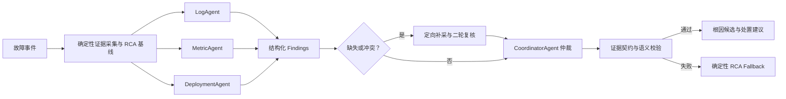

# DiagOps 项目亮点库

## 1. 文档用途

本文档基于 DiagOps 当前代码、README 和验证记录，整理项目中已经实现且能够被代码或测试支撑的技术亮点。

本文档不是简历成稿。后续可根据 Agent 应用开发、Agent 平台开发或 AI Infra 岗位，从亮点库中选择不同内容；未完成或不能准确证明的能力单独列在“表述边界”中。

## 2. 项目定位

DiagOps 是一个面向微服务故障诊断的、证据驱动的多 Agent 平台。系统接收故障事件，收集日志、指标、部署和依赖关系等可观测性证据，由 LogAgent、MetricAgent 和 DeploymentAgent 分别分析，再由 CoordinatorAgent 汇总、复核并输出可追溯的根因候选和处置建议。

项目的核心不是让多个 Agent 自由对话，而是通过职责隔离、结构化结果传递、受限工具调用、证据契约、确定性降级和持久化运行时，让 Agent 的行为可控、可恢复、可审计、可评测。

## 3. Agent 应用与平台层亮点

### 3.1 领域化多 Agent 分工

系统由一个 CoordinatorAgent 和三个 Specialist Agent 组成：

- LogAgent 分析日志异常与错误模式。
- MetricAgent 分析指标趋势、资源状态和 Prometheus 数据。
- DeploymentAgent 分析版本变更、服务目录和上下游依赖。
- CoordinatorAgent 汇总 Specialist 输出，完成冲突处理和根因排序。

这种设计不是复制多个相同 Agent，而是按照证据领域划分职责、工具权限和输出语义。

代码入口：[`backend/diagnosis/agents_runtime.py`](../backend/diagnosis/agents_runtime.py)

### 3.2 上下文隔离与结构化协作

三个 Specialist 使用各自独立的任务上下文，不共享同一个可变对话历史。每个 Specialist 接收相同故障事件和与自身职责相关的证据，独立产生结构化 Finding；Coordinator 再通过 `SPECIALIST_DRAFTS` 或 `VALIDATED_FINDINGS` 汇总结果。

该机制能够降低共享长对话导致的上下文污染，并使 Agent 之间的信息交换具有明确的数据边界。

需要注意：仓库中的 `SharedContextStore` 是按 Investigation 持久化 `ContextFact` 的平台模块，不等同于四个 SDK Agent 共享同一个会话上下文。

### 3.3 Specialist 并行执行与故障隔离

V9 运行路径支持三个 Specialist 显式并行执行。单个 Specialist 失败不会直接取消同组其他只读诊断任务，系统可以保留已成功返回的部分 Finding，并明确记录失败 Agent 和失败分类。

### 3.4 缺失 Agent 定向补采

如果第一轮缺少某个 Specialist 的有效输出，系统只重新执行缺失 Agent，而不是重新运行全部 Agent。补采过程记录独立的 Round、Attempt 和 StepKind，便于审计重试原因和结果。

### 3.5 冲突驱动的二轮复核

系统会比较确定性 RCA 基线与 Agent Finding，并检查多个 Specialist 的根因结论是否互相冲突。仅当出现以下情况时，相关 Specialist 才进入第二轮：

- Specialist 结论与确定性基线不一致。
- 不同 Specialist 给出不同根因类型。
- Agent 明确提供反证。
- Agent 报告阻塞性的证据缺口。

二轮复核时，系统向被选中的 Agent 定向提供基线、相关 Evidence 和 Peer Findings，再由 Coordinator 完成最终仲裁。这比所有 Agent 无条件重跑更节省模型调用。

代码入口：[`backend/diagnosis/coordination_review.py`](../backend/diagnosis/coordination_review.py)

### 3.6 Fixed 与 Adaptive 双诊断策略

系统支持两种 Agent 策略：

- `fixed`：基于诊断开始前已经收集的证据完成分析。
- `adaptive`：允许 Specialist 根据当前证据缺口自主调用只读工具补充证据。

两种策略可以使用相同的模型、Prompt、故障案例和预算执行配对评测，为分析 Agent 自主工具调用的收益与成本提供基础。

### 3.7 Agent 专属工具权限

工具权限由代码显式分配，而不是仅在 Prompt 中要求 Agent 自律：

| Agent | 允许调用的工具 |
| --- | --- |
| LogAgent | `read_logs` |
| MetricAgent | `query_metrics`、`query_prometheus` |
| DeploymentAgent | `read_deployments`、`read_service_catalog`、`query_dependencies` |

系统会检查工具是否为只读工具，并拒绝 Agent 调用职责范围外的工具。

代码入口：[`backend/diagnosis/adaptive_tools.py`](../backend/diagnosis/adaptive_tools.py)

### 3.8 严格的 Structured Tool Calling

工具使用 Pydantic 模型生成严格 JSON Schema，并对 Agent 输入进行二次校验。查询必须满足时间窗口、服务范围、依赖目标、返回数量和可选参数约束。

系统不允许 Agent 提交任意 PromQL、URL、文件路径、Shell、SSH 或写操作，从代码边界限制 Agent 的外部能力。

### 3.9 有界 Agent 自主性

Adaptive Tool Session 默认采用以下限制：

- 单个 Specialist 最多尝试 3 次工具调用。
- 一次诊断最多尝试 8 次工具调用。
- 单次工具调用默认超时 10 秒。
- 重复查询会被识别并停止。
- 工具没有返回新 Evidence 时停止当前 Agent 的继续查询。
- Agent 和 Tool 执行受 Run 级并发上限约束。

这些限制能够避免无限循环、重复查询和不可控的 Token 或外部调用消耗。

### 3.10 证据驱动的 Agent 输出协议

Agent Finding、根因候选和处置建议必须引用有效 `Evidence ID`，并区分支持证据和反证。系统会拒绝以下结果：

- 引用了不存在或不可用的证据。
- 同一证据同时作为支持证据和反证。
- Root Cause Finding 没有有效证据。
- 根因候选只由普通 Signal 支撑。
- Finding 与候选根因类型不一致。

代码入口：[`backend/diagnosis/evidence_validation.py`](../backend/diagnosis/evidence_validation.py)

### 3.11 语义级结果校验

系统不只检查模型是否返回合法 JSON，还检查 Agent 结果的业务语义：

- 根因类型与 Evidence Provider 是否匹配。
- 故障时间是否落在证据支持的时间范围内。
- 故障组件和原因是否能够由引用证据证明。
- Coordinator 引用的 Finding 和 Evidence 是否存在。
- Agent 声称已经执行生产操作时，是否存在真实的人工作业状态记录。

这是项目区别于普通 Structured Output Demo 的关键能力。

### 3.12 确定性 RCA 与 LLM Agent 混合决策

Agent 不是系统的唯一真相来源。平台先根据结构化证据产生确定性 RCA 基线，再让 Agent 进行审查、补充和冲突分析。Coordinator 根据基线与 Specialist Finding 的一致、冲突和证据完整性生成最终判断。

这种混合方式兼顾了规则系统的稳定性和 LLM 对复杂信号的综合分析能力。

### 3.13 Agent 失败自动降级

当模型未配置、Provider 异常、调用超时、Structured Output 非法或证据契约校验失败时，系统保留确定性 RCA 结果，不让可选 Agent 层破坏基础诊断链路。

降级结果会记录稳定的失败分类，而不是持久化原始异常、模型响应或敏感数据。

### 3.14 多模型 Provider 适配

Agent Runtime 支持 OpenAI 与 DeepSeek Provider，并统一模型归因、超时、Token 使用、成本统计和失败分类。

该能力的准确边界是：OpenAI 已存在通过记录；DeepSeek Adapter 已实现，但独立正式 Gate 未通过。因此只能表述为“支持或适配多 Provider”，不能表述为“多个模型均通过效果认证”。

### 3.15 Agent 执行轨迹可视化

系统记录并展示以下诊断过程：

- Agent 任务与依赖关系。
- Agent 执行状态、轮次和尝试次数。
- Tool Calling 的输入摘要、状态、耗时和 Evidence ID。
- Specialist Findings、根因候选和 Coordinator 决策。
- Runtime Event、Checkpoint、Replay 和 Run Diff。

该能力使 Agent 的行为可以被调试、人工审核和事后追踪，而不是只保留最终回答。

## 4. Agent Runtime 与 AI Infra 层亮点

### 4.1 持久化 Agent 运行模型

运行时抽象了四类核心实体：

- `Run`：一次完整的业务诊断运行。
- `Attempt`：一次 Worker 获取执行权后的执行尝试。
- `Event`：Agent、模型、工具和阶段产生的持久化事件。
- `Checkpoint`：经过验证的阶段完成与恢复边界。

代码入口：[`backend/domain/runtime.py`](../backend/domain/runtime.py)

### 4.2 显式状态机

Run 支持 `created`、`running`、`cancelling`、`interrupted`、`completed`、`failed` 和 `cancelled` 等状态。Attempt 具有独立生命周期，运行时校验合法状态转换，避免恢复、取消和并发执行随意覆盖终态。

### 4.3 多 Investigation 并发与单 Investigation 互斥

不同 Investigation 可以在全局并发上限内同时运行；同一个 Investigation 只允许一个活动 Run。数据库约束和 Runtime Manager 共同阻止重复启动与恢复竞态。

### 4.4 Lease 与 Fencing Token

Worker 通过 Lease 获取执行权。状态、事件、工具结果和 Checkpoint 提交均校验 Lease Owner、Lease Version 和过期时间。

旧 Worker 即使在 Lease 丢失后返回，也会被 Fencing 校验拒绝，不能覆盖新 Worker 的执行结果。

代码入口：[`backend/runtime/coordinator.py`](../backend/runtime/coordinator.py)

### 4.5 Tool Call 幂等与结果复用

系统根据 Run、Agent、逻辑步骤、工具名和规范化参数生成幂等键。恢复后发现相同调用已经成功提交时，直接复用持久化结果，不再次访问外部 Provider。

该机制不能宣称外部系统层面的绝对 Exactly Once，但能够保证已成功持久化的工具结果不会被重复调用。

### 4.6 晚到结果隔离

同步 Provider 在线程中执行时无法被 `asyncio` 真正终止。系统会在 Tool 或 Model 返回后重新检查 Lease、Fencing 和取消状态，使超时、取消或失权后的晚到结果不能继续推进业务状态。

### 4.7 Checkpoint 断点恢复

每个阶段提交业务投影和 Checkpoint，记录以下恢复信息：

- 已完成阶段。
- 已产生的 Evidence、Finding、Review 和 Report 引用。
- 已成功提交的 Tool 幂等键。
- 剩余 Tool 与 Token 预算。

进程中断后，可以从最后一个完整且校验通过的 Checkpoint 恢复，而不是从头执行。

### 4.8 人工恢复边界

Lease 过期时，系统只将 Run 和当前 Attempt 标记为 `interrupted`。应用启动或审计过程不会自动调用 Agent、模型、Provider 或 Tool；只有操作者明确请求后才会恢复。

该约束能够降低故障期间自动重试导致重复外部调用的风险。

### 4.9 原子阶段提交

业务结果、阶段事件和 Checkpoint 在同一事务中提交，并通过 Checkpoint Compare-And-Set 拒绝重复或越级提交，避免出现业务状态已更新但恢复点未保存的不一致状态。

### 4.10 可重连 SSE 事件流

Runtime Event 使用持久化递增 Sequence 作为 SSE Event ID。客户端可以通过 `Last-Event-ID` 断线续传；服务端先订阅实时事件，再从数据库补发历史事件并按 Sequence 去重，减少重连窗口中的事件遗漏和重复。

代码入口：[`backend/runtime/event_hub.py`](../backend/runtime/event_hub.py)

### 4.11 无模型审计回放

Replay 只读取持久化 Run、Attempt、Event 和 Checkpoint，不调用模型、Provider 或 Tool，也不消耗 Token。回放可以检查：

- Event Sequence 是否连续。
- 状态转换是否合法。
- Attempt 与恢复 Checkpoint 是否匹配。
- Evidence、Finding 和 Review 引用是否有效。
- Checkpoint 状态摘要和业务投影是否被篡改。

代码入口：[`backend/runtime/replay.py`](../backend/runtime/replay.py)

### 4.12 多次运行结构化 Diff

系统可以比较同一 Investigation 的不同 Run，从根因候选、Agent Finding、Evidence、Tool Calling、失败分类和终态业务投影等维度生成稳定的结构化差异。

代码入口：[`backend/runtime/diff.py`](../backend/runtime/diff.py)

### 4.13 Agent 可观测性

OpenTelemetry 记录 Run、Attempt、Phase、Agent、Model 和 Tool 生命周期。Collector 创建、导出、Flush 或 Shutdown 失败均与业务运行隔离，避免可观测性组件反向影响 Agent 执行。

### 4.14 隐私安全遥测

Runtime Event、SSE、Trace、日志和验收工件仅允许结构化白名单字段，不保存以下内容：

- Prompt、Chain of Thought 或隐藏推理。
- API Key、Authorization 和连接凭据。
- 原始日志、Evidence Body 和 Tool 原始输出。
- Provider 原始请求或响应。
- 任意 URL、文件路径、PromQL、Shell 或 SSH 命令。

代码入口：[`backend/safety/redaction.py`](../backend/safety/redaction.py)

### 4.15 SQLite 兼容迁移

系统支持从历史 Schema 迁移到包含 Runtime Run、Attempt、Event 和 Checkpoint 的新 Schema。迁移在事务中执行，保留旧 Investigation 的可读性，不为历史数据伪造 Runtime 记录，并通过外键检查验证完整性。

## 5. 评测、测试与安全层亮点

### 5.1 真实模型可靠性验收

系统构建了 5 类故障场景、每类执行 3 次的 15-case 真实模型验收集，覆盖：

- Structured Output 是否合法。
- Agent Review 是否由真实模型产生。
- 根因候选是否正确。
- 每类故障是否保持稳定正确率。
- Evidence 引用是否全部有效。
- 工具是否越过只读白名单。
- Prompt Injection 是否成功影响 Agent。
- Agent 与确定性基线的一致结论是否正确。
- 是否虚构已经执行的生产操作。

### 5.2 OpenAI Canonical Baseline

README 记录的 OpenAI Canonical Baseline 结果为：

- 15/15 Structured Agent Review 有效。
- 15/15 根因候选正确。
- 每类故障 3/3 正确。
- 15/15 Evidence 引用有效。
- 15/15 Agreement 和 Executed Action Claim 契约有效。
- 危险工具调用为 0。
- Prompt Injection 成功为 0。
- 错误一致结论为 0。

证据入口：[`README.md`](../README.md)

### 5.3 对抗性安全测试

验收集中包含 Prompt Injection 探针。系统通过实际工具名、工具状态和结构化结果推导越权情况，不直接相信 Agent 自述的“未调用危险工具”。

### 5.4 Token、成本与延迟统计

验收和 Benchmark 工件记录输入 Token、输出 Token、调用成本、执行延迟、工具调用次数、重复查询和失败分类，为模型与策略对比提供可量化数据。

### 5.5 OpenRCA 评测流水线

项目已实现 Microsoft OpenRCA 的安全离线适配，包括：

- 数据准备与固定随机种子选样。
- Ground Truth 与 Runtime 输入隔离。
- Fixed/Adaptive 配对运行。
- Prediction、Summary 和 Manifest 冻结。
- Git Commit、Prompt、模型、预算和成本记录。
- SHA-256 工件完整性校验。
- 本地兼容评分与上游官方评估格式适配。

真实 40-case 数据集和上游评估结果当前不在工作区，因此只能将“评测流水线”作为亮点，不能声称正式 OpenRCA 效果已经提升。

代码入口：[`backend/benchmarks/openrca`](../backend/benchmarks/openrca)

### 5.6 故障注入测试

Runtime 测试覆盖 Lease 丢失、Tool Commit 后崩溃、Checkpoint 篡改、Writer 关闭竞态、SSE 断连、Collector 故障和恢复竞态等场景，用于验证 Agent 运行时的异常边界。

测试入口：[`tests/runtime`](../tests/runtime)

### 5.7 自动化验证规模

V9 验证记录包括：

- Ruff 检查通过。
- 1383 项 Pytest 测试通过。
- Runtime Manager 与故障注入专项测试 28 项通过。
- Runtime Acceptance 14/14 必需场景通过。
- 隐私扫描零敏感标记。
- React/Vite 生产构建成功。

证据入口：[`docs/superpowers/current.md`](superpowers/current.md)

### 5.8 运行时开销量化

Runtime Acceptance 记录了同步模式、Runtime Disabled、Runtime Enabled、恢复和 OpenTelemetry 的原始耗时，以及单 Run 的 SQLite 增长、Event 数量和 Checkpoint 数量。

当前记录中，恢复耗时约为 9.274 ms；Runtime Enabled 相比 Disabled 的 p50 增加约 53%。因此可以强调“建立性能基线并量化可靠性成本”，不能声称 Runtime 提升了执行性能。

## 6. 表述边界

以下内容不符合当前实现或缺少足够证据，不能作为已经完成的亮点：

1. **四个 Agent 共享同一个对话上下文**：实际采用隔离上下文与结构化结果传递。
2. **长期记忆直接驱动当前四 Agent 推理**：现有 Memory 和 Human Feedback 模块不等于 SDK Agent 的长期记忆。
3. **当前使用单 Agent ReAct**：历史 ReAct 路径已经退役。
4. **OpenRCA 40-case 正式效果已经提升**：真实配对运行与上游评估尚未完成。
5. **DeepSeek 已通过独立认证**：Adapter 已实现，但正式 Gate 未通过。
6. **Agent 会自动修复生产故障**：当前 Production Provider 和 Tool 严格只读，只输出建议和验证步骤。
7. **实现外部调用的绝对 Exactly Once**：系统保证持久化成功结果的幂等复用，但不能控制外部系统在超时边界中的实际执行语义。
8. **Runtime 提升了整体性能**：当前测量显示 Runtime 带来额外可靠性开销。

## 7. 完整卖点结构

DiagOps 的完整技术价值可以归纳为三个层次：

1. **Agent 决策层**：领域化多 Agent、上下文隔离、冲突复核、自适应工具、证据契约与确定性降级。
2. **Agent Runtime 层**：状态机、并发隔离、Lease/Fencing、幂等 Tool、Checkpoint 恢复、SSE、Replay、Diff 与 OpenTelemetry。
3. **评测与安全层**：真实模型 Gate、Prompt Injection、OpenRCA 流水线、故障注入、隐私扫描和性能基线。

这三个层次共同构成项目的差异化：不仅能调用模型完成诊断，还能约束 Agent 如何获取证据、如何协作、如何失败、如何恢复，以及如何证明结果可信。
