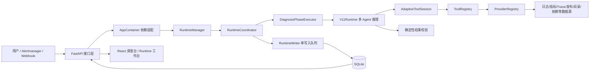
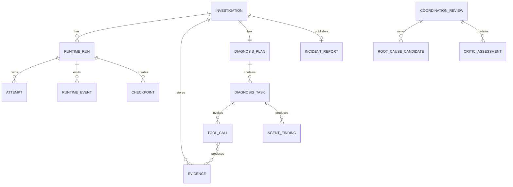

# 02. 系统架构总览

## 1. 先看全景



这张图里最重要的分界是：

- **推理面**：Lead、Investigator、Critic 判断“可能是什么原因”；
- **控制面**：Runtime 管理阶段、预算、并发、超时、取消、恢复和审计；
- **数据面**：Provider 读取日志、指标、Trace 等证据；
- **持久化面**：Repository 和 Runtime Store 把业务结果与运行轨迹写入 SQLite；
- **展示面**：FastAPI 把数据投影给 React 页面。

## 2. 目录与职责

| 目录 | 职责 | 初学者理解 |
| --- | --- | --- |
| `backend/api` | HTTP 接口 | 前台窗口，接收请求、返回结果 |
| `backend/services` | 应用装配、验收、公开投影 | 把各部件组装起来的总务处 |
| `backend/diagnosis` | Agent、规划、协调、校验、工具会话 | 诊断大脑与调查流程 |
| `backend/tools` | 工具注册、工具到 Provider 的桥接 | Agent 能看到的受控按钮 |
| `backend/providers` | 读取不同证据源 | 真正去数据源取材料的适配器 |
| `backend/domain` | Pydantic 领域契约 | 全系统统一使用的表格格式和规则 |
| `backend/runtime` | Run、Attempt、阶段、事件、Checkpoint | 确保工作可控、可恢复、可审计的流水线 |
| `backend/db` | SQLite 表、迁移、Repository | 档案库 |
| `backend/reports` | Markdown 报告生成 | 把结构化诊断变成人能读的报告 |
| `backend/benchmarks` | OpenRCA 与 RCAEval 评测 | 考场与计分系统 |
| `backend/safety` | 脱敏和安全值校验 | 防止秘密或危险数据流出去 |
| `frontend/src` | React 页面、API 客户端、SSE | 操作台和可视化 |
| `tests` | 分层测试和验收 | 对架构承诺逐项验真 |

## 3. 应用如何启动

入口是 [backend/main.py](../../backend/main.py)：

1. 创建 FastAPI 应用；
2. 注册健康、配置、事件、调查、Agent、Benchmark、Runtime 等路由；
3. 应用启动时取得 `AppContainer`；
4. Container 启动 RuntimeWriter、检查过期 lease、启动 RuntimeManager；
5. 应用关闭时停止调度、清空已接受写入并关闭遥测。

[AppContainer](../../backend/services/container.py) 是组合根，也就是“全项目对象在何处被创建并连接”的地方。它创建：

- Settings；
- SQLite 或内存 Repository；
- ProviderRegistry；
- VerifiedMemoryLookup；
- ToolRegistry；
- 旧 AgentsRcaRuntime 和 V11Runtime；
- DiagnosisOrchestrator；
- Runtime Store、Writer、Coordinator、Manager；
- Replay 和 Diff 服务。

面试时如果被问“依赖关系从哪里看”，先指向 Container，而不是在每个模块里盲找。

## 4. 请求进入后的主链路

### 4.1 入口

事故可以来自：

- `POST /events`：通用事件；
- `POST /events/alertmanager`：Alertmanager；
- `POST /events/simulated/{case_id}`：模拟场景；
- `POST /investigations/manual`：人工输入。

API 把外部输入校验为 `IncidentEvent`。事件包含服务、环境、标题、描述、开始时间、时间窗口和信号。

### 4.2 创建 Investigation 与 Runtime Run

`Investigation` 是业务视角的一次事故调查；`Runtime Run` 是执行视角的一次具体运行。一个 Investigation 可以有多个历史 Run，但同时最多有一个活动 Run。

在 V11 中，系统必须先持久化 V11 Run 和冻结的执行契约，才能收集证据或调用模型。这样即使当前配置后来变化，恢复时仍按创建时的模型、工具清单和预算执行。

### 4.3 Coordinator 驱动阶段

RuntimeCoordinator 取得 Run 的 lease，创建 Attempt，然后按 Run 的不可变执行版本选择阶段表。每个阶段遵循：

```text
校验 lease / 取消 / deadline
  → 发出 phase.started
  → 执行业务逻辑
  → 原子提交业务投影 + event + checkpoint
  → 进入下一阶段
```

### 4.4 Agent 推理与工具取证

V11Runtime 在 Agent 阶段创建 OpenAI Agents SDK 的 `Agent`，传入：

- 角色指令；
- 结构化上下文；
- 允许的工具；
- Pydantic 输出类型；
- 最大 turns、Token、工具和时间预算。

只有 Investigator 获得 Provider 工具。Lead 和 Critic 的 `tools=[]`，从代码层面减少越权面。

### 4.5 结果校验、报告与完成

终态 authority projection 后，`validate_v11_result` 只做机械可判定的校验，例如：

- 引用 ID 是否存在、已提交且属于同一 Run；
- 任务、Finding、Candidate、Assessment 的所有权是否一致；
- 每个候选是否经过规定的 Critic 检查；
- 工具是否来自冻结 manifest；
- 实体和时间范围是否冲突；
- 文本、预算和执行覆盖是否合规。

校验器不能新增、替换或重新排序根因。通过后，报告生成器基于 V11 Review 生成报告；Finalizer 把业务状态和 Runtime 状态收口。

## 5. V10 与 V11 为什么并存

仓库经历了多次演进。当前代码保留两个不可混用的阶段配置：

```text
V10 legacy:
intake → evidence_collection → deterministic_rca
→ specialist_analysis → conflict_review → coordination
→ report_generation → finalize

V11:
intake → evidence_collection → lead_planning
→ investigator_round_1 → critic_review
→ investigator_round_2 → critic_reconciliation
→ lead_adjudication → result_validation
→ report_generation → finalize
```

V10 的最终权威是确定性 RCA 规则；V11 的最终权威是 Agent。历史记录必须可读，所以不能把旧阶段重命名后假装成新语义。阶段选择依据持久化的 `execution_contract_version`，而不是当前配置。

这体现两个架构原则：

1. **兼容读取不等于兼容执行。** 老数据可以看，但中断的 V10 Run 不会用 V11 语义偷偷续跑。
2. **执行身份必须冻结。** 恢复、重放和评测不能受“今天服务器配置是什么”影响。

## 6. 领域层为什么重要

`backend/domain` 不是普通的数据类集合，而是跨层契约：

- API 用它校验输入输出；
- Agent 输出用它做结构化约束；
- Tool 用它约束参数；
- Repository 用它持久化与恢复；
- Runtime Event 用它限制可记录字段；
- 前端 TypeScript 类型与它对应；
- 测试用它验证契约不漂移。

关键对象关系：



SQLite 不直接理解所有业务字段，许多复杂对象以版本化 JSON payload 存储；常查询和强约束字段则单独成列。这样可以在保持历史记录可读的前提下添加字段。

## 7. Provider 与 Tool 为什么分两层

两者常被混淆：

- **Provider** 关心“怎样从某种数据源读取证据”；
- **Tool** 关心“怎样把一个安全、稳定、对 Agent 友好的能力暴露出去”。

例如同一个 `query_traces` 工具可以由文件回放 Provider 或 Tempo Provider 实现。Agent 不需要知道底层是 CSV 还是 Tempo，这叫 provider-neutral contract。

这使得：

- 离线测试和真实适配器共享一个工具协议；
- Agent prompt 不绑定供应商；
- 数据源缺失时显式返回 gap，而不是偷偷换 mock；
- 新 Provider 不必改变 Agent 的思考接口。

## 8. 并发发生在三个层次

| 层次 | 并发对象 | 默认边界 |
| --- | --- | --- |
| 多 Investigation | 不同 Runtime Run | `max_concurrent_runs=4` |
| 单 Run 内步骤 | Provider/Agent/Tool 步骤 | `max_parallel_steps_per_run=3` |
| Agent 拓扑 | Round 1 Investigator | 最多 3 个 |

写数据库不随这些并发一起放开。外部 I/O 可以并行，业务投影通过 RuntimeWriter 串行短事务写入，避免 SQLite 并发写冲突和乱序状态。

## 9. 当前实现状态必须诚实表达

当前 `config/diagops.yaml` 默认：

- SQLite 开启；
- Runtime 开启；
- mock、日志文件、发布文件、服务目录 Provider 开启；
- Prometheus 和本地 incident package 关闭；
- Agents 关闭；
- 策略默认为 `fixed`。

因此“架构已包含 V11”与“默认本地启动会执行正式 V11”不是同一件事。正式 V11 还要求模型端点、凭证、能力认证工件和冻结执行契约。当前发布迭代仍被正式评测门阻塞。

## 10. 面试总结

可以这样概括架构：

“项目采用分层但不引入重型编排框架。FastAPI 负责入口，Container 负责装配，版本化 Runtime 负责可靠执行，V11Runtime 负责 Agent 拓扑，ToolRegistry 和 ProviderRegistry 分离 Agent 能力与数据源，Pydantic 领域模型贯穿 API、Agent 输出、持久化和测试，SQLite 保存业务投影与 append-only 运行事件，React 负责调查、Agent 证据链和 Runtime 时间线展示。最关键的边界是 Agent 负责诊断判断，确定性代码只负责安全和可验证执行。”
