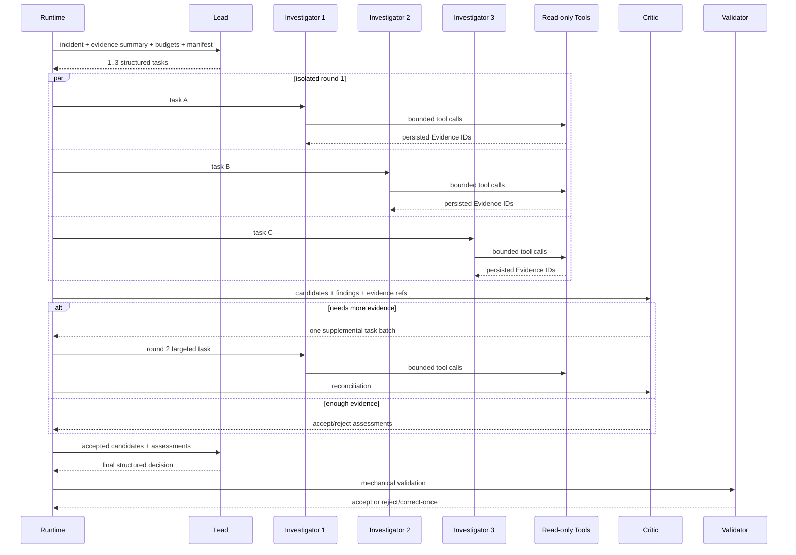

# 03. Agent 设计详解

## 1. 项目的 Agent 设计解决什么问题

Agent 架构不是为了“多几个模型显得高级”，而是为了解决诊断中的四个具体问题：

1. **避免过早收敛**：先找信息缺口，再决定查什么；
2. **降低相互影响**：第一轮 Investigator 看不到兄弟 Agent 的结论；
3. **强制反证**：Critic 必须检查因果链和反例；
4. **明确最终责任**：只有 Lead 做最终裁决，避免投票后无人负责。

V11 设计见 [V11Runtime](../../backend/diagnosis/v11_runtime.py) 和 [V11 设计第 7 节](../superpowers/specs/2026-08-02-diagops-v11-adaptive-multi-agent-rca-design.md#7-architecture-and-control-flow)。

## 2. Agent 的构成

在代码中，一个 Agent 至少由这些部分组成：

| 部分 | 作用 | 本项目实现 |
| --- | --- | --- |
| 名称/角色 | 告诉模型“你是谁” | Lead、Investigator、Critic |
| Instructions | 规定目标与边界 | V11Runtime 生成角色 prompt |
| Context | 本轮可看的结构化信息 | incident、task、evidence IDs、budgets 等 |
| Tools | 可调用函数 | 只有 Investigator 获得九工具中的冻结清单 |
| Output type | 最终必须交什么格式 | Pydantic 模型，如 `LeadPlanningOutput` |
| Model settings | turn、重试、工具选择等 | OpenAI Agents SDK `Agent` 与 `Runner` |
| 外部约束 | deadline、Token、工具次数、取消 | V11Runtime + RuntimeCoordinator |

核心调用在 `V11Runtime._call_model`：它先校验剩余预算和执行契约，再构造 SDK `Agent`，用 JSON 序列化的 context 运行，最后把响应转成指定 Pydantic 输出。

## 3. 三类角色

### 3.1 Lead：决定调查方向与最终裁决

Lead 有两次主要工作。

第一次是 `lead_planning`：

- 阅读事故、已有证据摘要、九工具清单和剩余预算；
- 找出最值得缩小的不确定性；
- 生成 1～3 个相互独立的调查任务；
- 为任务选择调查策略；
- 不能在这个阶段直接宣布根因。

第二次是 `lead_adjudication`：

- 阅读 Investigator 的 Findings、候选和 Critic Assessments；
- 只能选择 Critic 已接受的 Candidate ID；
- 可以给出 `complete`、`partial` 或 `inconclusive`；
- 如果引用不确定，宁可 `inconclusive`；
- 不允许调用 Provider 工具。

Lead 的权力大，但并非无限：任务数量、工具名称、技能名称、证据范围、Candidate ID、Token 和模型 turn 都由代码校验。

### 3.2 Investigator：真正查证据的人

Investigator 是通用调查员，不再固定为 LogAgent、MetricAgent、DeploymentAgent。每个实例可以根据任务使用所有九个允许的工具。

第一轮隔离规则：

- 每个实例只看事故、自己的任务、为自己选择的初始证据；
- 看不到兄弟 Investigator 的 Findings；
- 有独立 `AdaptiveToolSession`；
- 共享全局工具预算和并发门；
- 最多三个实例并行。

它输出：

- Observation/Correlation：观察或相关性；
- Candidate Cause：候选原因、受影响实体、失败机制；
- Contradiction：反证；
- Gap：缺失证据；
- RootCauseCandidate 草稿。

模型返回的主键不可信。服务端会重新生成全局唯一 Task ID 和 Candidate ID，防止多个模型都返回 `task-1` 或 `candidate-1` 造成冲突。

### 3.3 Critic：专门挑战候选

Critic 没有工具，不能自己偷偷补数据。它必须基于已提交的 Findings 和 Evidence，对每个候选形成 `CriticAssessment`。

设计要求每个候选接受固定的七项检查。当前领域契约中的检查名来自 `CausalCheckName`，用于覆盖时间顺序、实体/作用域、机制、替代解释、反证、证据独立性和症状/原因区分等机械可追踪的审查维度。

Critic 的判定可以是：

- 接受；
- 拒绝；
- 需要更多证据。

如果需要更多证据，它只能产生一批第二轮任务。第二轮结束后进行一次 reconciliation，禁止再要求第三轮，防止开放式反思循环。

## 4. 完整 Agent 时序



## 5. 为什么不用固定专家

旧版本把 Agent 固定为日志、指标和发布三个模态专家。这样简单，但会产生“数据源先于问题”的偏差：

- 日志 Agent 只会从日志角度找原因；
- 指标 Agent 只会从曲线角度找原因；
- 如果根因跨 Trace、依赖和 Runtime state，任务一开始就被切碎；
- 最终协调容易变成对三个孤立意见做拼接。

V11 让 Lead 按**信息缺口**分任务。例如：

- “沿失败 Trace 找到第一个异常服务”；
- “比较错误实例与健康实例的指标和 Runtime state”；
- “验证发布时间是否早于错误率上升”；
- “寻找数据库变慢以外的替代解释”。

每个任务可以跨多个工具，这比按数据模态分工更贴近真实诊断。

## 6. 为什么不用多数投票

三个 Agent 都说“发布导致事故”不代表正确，因为它们可能：

- 使用了同一模型，具有相关偏差；
- 看到了相同的误导信号；
- 都把时间相关误当因果；
- 相互复制了最先出现的结论。

项目选择 Critic + Lead，而不是 vote：

- Critic 逐项检查证据是否足以支撑因果；
- Lead 对被接受的候选负责；
- 最终输出保留替代解释和不确定性；
- 没证据就 `inconclusive`。

## 7. “Agent 是诊断权威”究竟是什么意思

V11 最重要的架构变化是 authority inversion：

- 旧路径中确定性 `RcaAnalyzer` 根据规则生成 Hypothesis，Agent 更像复核层；
- V11 中 Lead/Investigator/Critic 产生和筛选 RootCauseCandidate；
- 确定性代码可以拒绝违规结果，但不能发明、替换或重排根因；
- 报告从 V11 Review 生成，不再以旧 Hypothesis 为前提。

这不等于“相信模型的一切”。正确理解是：

```text
语义判断权 → Agent
执行控制权 → Runtime
数据访问权 → Tool/Provider allowlist
格式与引用否决权 → Validator
最终生产动作权 → 人类
```

## 8. 结构化输出怎样工作

自由文本很难可靠解析，所以每个阶段要求特定 Pydantic 输出。例如：

- Lead planning → `LeadPlanningOutput`；
- Investigator → `InvestigatorOutput`；
- Critic → `CriticOutput`；
- Lead adjudication → `LeadAdjudicationOutput`。

对原生支持结构化输出的模型，SDK 按 output type 约束响应。对于只能通过 Tool Call 稳定返回结构化结果的兼容端点，项目创建 `submit_structured_output` 严格输出工具：模型必须把 JSON 字符串放入唯一的 `payload_json` 字段，服务端再按 Pydantic schema 校验。

这解决的是传输格式，不保证内容正确。内容仍要经过引用、作用域、所有权和因果流程校验。

## 9. Diagnostic Skills 是什么

项目里的 Skills 不是可执行插件，而是版本化、只包含数据的调查策略记录：

- first-failure timeline；
- trace backtracking；
- change/peer comparison；
- causal falsification。

Lead 可以选择 Skill，Investigator prompt 得到相应方法提示。Skill catalog 的版本和哈希会进入执行契约，保证恢复和评测时使用同一套策略。项目刻意没有新增 Skill 执行引擎或 MCP 框架。

## 10. 失败处理不是“全部重来”

| 失败点 | 处理 |
| --- | --- |
| Lead planning 失败 | Agent Run 失败 |
| 一个 Round 1 Investigator 失败 | 其他有效 Investigator 可继续，最终最多为 partial |
| 所有 Round 1 Investigator 失败 | Run 失败 |
| Critic 失败 | Run 失败，不能接受未审查候选 |
| Round 2 关键证据拿不到 | 根据是否还能形成有效结论决定 inconclusive 或失败 |
| Lead adjudication 违规 | 允许一次无工具修正，仍失败则 Run 失败 |
| 最终校验违规 | 允许一次无工具 inconclusive 修正，仍失败则 Run 失败 |

单个 Finding 或 Candidate 草稿违规时，系统可以只拒绝那个草稿并留下失败审计，不必让同一批合法内容陪葬。但代码不会替模型修补引用。

## 11. Token、turn 和工具预算

V11 同时限制：

- 整个 Run 的硬 deadline；
- SDK/model turns；
- Token 总预算；
- 全局工具调用数；
- 每个 Investigator 工具调用数；
- Investigator 数量；
- 调查轮数；
- 每个工具超时；
- 并行步骤数。

模型调用前先预留 Token，完成后按实际 usage 结算；失败或取消只结算能证明已消耗的部分。模型重试也消耗同一个冻结预算，不会获得新额度。

## 12. 面试追问：这是 Manager 还是 Handoff 模式

它更接近**应用控制的 manager/orchestrator 模式**，但不是让一个自由 Agent 长期持有所有控制权：

- Runtime 按确定性阶段调用不同角色；
- Lead 产出任务，但不直接接管执行循环；
- Investigator 和 Critic 不互相 handoff；
- 每阶段结果先结构化、持久化和校验，再进入下一阶段。

这样做牺牲了一些自由度，换来可恢复、可审计、可比较和明确的安全边界，适合事故诊断这种高风险场景。

## 13. 一分钟回答模板

“V11 不是固定日志/指标专家，也不是多 Agent 投票。Lead 先依据事故、已有证据和预算规划 1 到 3 个信息缺口任务；通用 Investigator 第一轮相互隔离，每个都能使用同一冻结的九个只读工具；Critic 对候选进行固定因果检查，最多要求一轮补证；最后 Lead 只能在经过 Critic 的候选中裁决。各阶段用 Pydantic 结构化输出。Runtime 管理 deadline、Token、turn、工具预算和持久化；Validator 只能拒绝机械违规，不能替 Agent 生成根因。这使 Agent 真正拥有诊断权威，同时把不可控性关在确定性边界内。”
