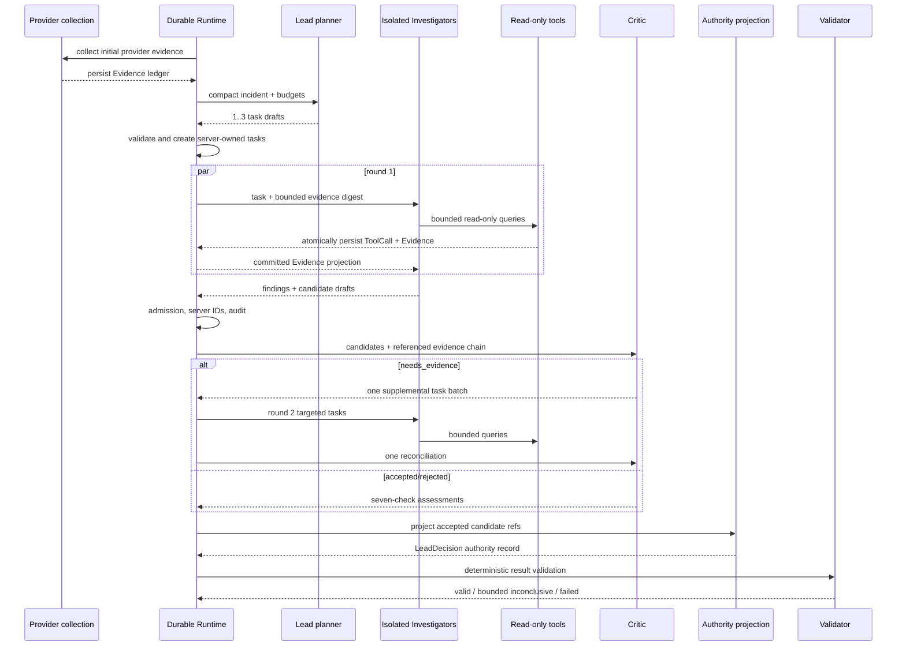

# 03. Agent 设计详解

这一章先讲“为什么”，再讲“代码怎样做”。如果你完全没接触过 Agent，可以先记住：**Agent 不是一种神秘的新程序，而是“模型 + 角色说明 + 可见上下文 + 可调用工具 + 输出格式 + 外部控制器”的组合。**

## 1. 为什么事故诊断适合 Agent，也不能只靠 Agent

普通代码擅长明确规则，例如判断时间是否合法、Evidence ID 是否存在、工具是否只读。事故诊断却常常没有一条固定公式：同样的 5xx 上升，可能来自发布、下游超时、连接池耗尽，也可能只是受害服务的表面症状。

LLM 擅长把日志、指标、Trace 和拓扑关系组织成假设，但它也会：

- 太早相信第一个看起来合理的解释；
- 把时间相关误当成因果；
- 引用不存在的数据；
- 忘记预算和权限；
- 在长上下文里忽略关键证据。

DiagOps 因此采用两层分工：

```text
需要理解语义、提出假设、比较解释的工作 → Agent
需要百分之百守住权限、预算、状态和引用的工作 → 确定性 Runtime
```

这叫“诊断权威与执行控制分离”。确定性代码可以拒绝一个违规结论，但不能悄悄生成一个模型没有提出的根因。

## 2. 一个 Agent 在本项目里由什么组成

| 组成 | 通俗解释 | 当前实现 |
| --- | --- | --- |
| Role | 它在团队里负责什么 | Lead、Investigator、Critic |
| Instructions | 岗位说明书 | `V11Runtime` 生成的角色 prompt |
| Context | 这一轮允许阅读的材料 | incident、自己的 task、Evidence 摘要、候选、预算 |
| Tools | 可以向外部世界提出的查询 | 只有 Investigator 获得冻结的九个只读工具 |
| Output schema | 必须填写的结构化表格 | Pydantic output model |
| Model runner | 把说明、上下文、工具交给模型 | OpenAI Agents SDK `Agent` / `Runner` |
| Guardrails | 模型无法自行修改的规则 | Runtime、ToolSession、Validator、数据库契约 |

核心入口是 [`V11Runtime`](../../backend/diagnosis/v11_runtime.py)。它没有把整个流程交给模型自由循环，而是由持久化 Runtime 按阶段调用不同角色。

## 3. 三类角色到底怎样分工

### 3.1 Lead：规划者，不是万能主管

Lead 首先执行 `plan_lead`。它不负责直接查日志，也不应该在规划阶段宣布根因。它要回答的是：

- 当前最重要的信息缺口是什么？
- 哪几个调查方向彼此有区分度？
- 现有预算最多支持多少任务？
- 哪种调查方法最适合每个任务？

它可以产生 1～3 个任务草稿。服务端随后验证数量、描述、技能、工具清单和预算，再生成真正的 Task ID。模型不能拥有数据库主键。

容易说错的一点是“Lead 最后再调用一次模型裁决”。当前实现要区分两条路径：

- **真实 live Agents SDK 路径**：Critic 已经完成候选判断，`lead_adjudication` 阶段由服务端把 Critic 的 `accept` verdict 机械投影成权威 Candidate ID；这里记录一条 `CUSTOM` Lead execution，但不冒充额外模型调用。
- **注入式测试/兼容适配路径**：当 Runtime 注入自定义 `turn` 时，仍可调用 `LeadAdjudicationOutput`，并校验它只能选择 Critic 接受的候选。

因此，`lead_adjudication` 是**终态权威阶段名称**，不是“必然发生第二次 Lead 模型调用”的承诺。关键领域词义见 [CONTEXT.md](../../CONTEXT.md)。

### 3.2 Investigator：受控的调查员

Investigator 负责真正取得新证据。它不是固定的 LogAgent 或 MetricAgent，而是根据自己的信息缺口选择工具的通用调查员。

第一轮最多三个实例并行，并且彼此隔离：

- 只看到事故、自己的任务和为任务选择的初始证据；
- 看不到兄弟 Investigator 的 Findings 和候选；
- 每个实例有独立的 `AdaptiveToolSession`；
- 共享全 Run 的工具、Token、turn、deadline 和并发上限；
- 每个实例都只能使用同一份冻结九工具 manifest。

隔离不是为了保密，而是为了减少“第一个 Agent 说了什么，其他 Agent 就跟着说什么”的锚定效应。

Investigator 可以产生两类内容：

1. `AgentFinding`：观察、相关性、候选原因、反证或证据缺口；
2. `RootCauseCandidate` 草稿：真正准备交给 Critic 审查的根因候选。

候选至少要说明：

- `affected_entity`：谁出了问题；
- `failure_class`：短而稳定的故障分类，指标证据有 `signal_family` 时应沿用它；
- `failure_mechanism`：面向人的机制解释；
- `supporting_evidence_ids`：支撑它的已提交证据；
- 可选的反证、时间窗、不确定性和 rationale。

例如：

```text
affected_entity = payment-service
failure_class = socket
failure_mechanism = 下游连接建立失败导致支付请求超时
```

`failure_class` 适合稳定评分和聚合，`failure_mechanism` 适合解释。不能因为模型不知道更深层原因，就把已有的 `socket` 信号泛化成模糊的 `service failure`。

### 3.3 Critic：诊断判断的审查者

Critic 没有 Provider 工具。它不能一边审稿一边偷偷查询新数据，只能审查当前 Run 中已经提交、状态可用且与候选引用链相关的 Evidence。

每个候选必须恰好经过七项检查：

| 检查 | 要问的问题 |
| --- | --- |
| `temporal` | 原因是否早于或覆盖症状时间？ |
| `topology` | 实体和上下游关系是否对得上？ |
| `mechanism` | 证据能否解释故障如何发生？ |
| `blast_radius` | 影响范围是否与候选相符？ |
| `symptom_vs_cause` | 这是根因，还是被影响后的症状？ |
| `counterevidence` | 有没有与候选冲突的证据？ |
| `alternatives` | 是否还有同样能解释现象的替代原因？ |

每项状态只有 `pass`、`fail`、`unknown`。如果没有证据，Critic 必须用 `unknown` 并明确 `gap`，不能凭感觉填 `pass`。

Critic verdict 可以是：

- `accept`：候选可进入权威投影；
- `reject`：证据或因果链不成立；
- `needs_evidence`：需要一批有明确归属的补证任务；
- `inconclusive`：当前无法得出判断。

Candidate ID 和 Evidence ID 引错时，Critic 最多获得一次带精确白名单的纠正机会。纠正仍失败，Critic 阶段失败；系统不会放行未经审查的候选。

## 4. 当前完整时序



入口阶段还会先通过 Provider registry 收集一批初始证据，构造 `DiagnosisContext` 并持久化。也就是说，Lead 和 Investigator 并不是在完全空白的事故上开始聊天。

## 5. 为什么不用固定日志、指标、发布专家

固定专家按“数据源”切任务，真实事故却常按“信息缺口”跨数据源：

- 一条 Trace 找到首次失败服务；
- 日志说明连接被拒绝；
- 指标确认 socket 错误与事故时间一致；
- 发布记录排除刚发布版本；
- 依赖拓扑确认影响传播方向。

如果先规定“你只能看日志”，模型会为了完成岗位而从日志里硬找答案。V11 让 Lead 描述问题，让通用 Investigator 选择必要工具，减少数据模态偏见。

## 6. 为什么不用多数投票

三个 Agent 使用同一个模型时，错误通常不是独立事件。它们可能同时受到同一误导日志、同一 prompt 偏差或同一训练偏好的影响。三票赞成并不等于三份独立证据。

本项目使用的是：

```text
独立调查 → 持久化证据 → 固定因果检查 → 受约束权威投影
```

票数本身没有权威。一个候选即使由多个 Investigator 提出，也必须引用合法证据并通过 Critic 检查。

## 7. 多 Investigator 怎样要求交叉证据

当前 multi prompt 要求一个候选至少引用两条不同的可用 Evidence ID，它们应共同支持同一实体和机制，相关时优先来自不同 kind/provider。如果初始摘要只有一条相关证据，Investigator 应做一次有界只读查询取得第二条；找不到就不要产出候选。

这里有一个源码级细节值得诚实说明：

- prompt 明确要求 multi 候选至少两条相关证据；
- Pydantic 和共享候选准入层目前机械下限仍是至少一条合法 supporting evidence；
- 机械层会检查存在性、状态、Run 归属和 scope，但不会假装知道“两条证据在语义上是否真正互相印证”。

所以不能把它说成“代码已经能证明证据独立”。语义上的交叉印证仍属于 Investigator 与 Critic 的诊断职责。

## 8. 模型输出为什么分 compact 与完整契约

真实 live 路径尽量只让模型填写它真正拥有的字段：

| 阶段 | Live compact 输出 | 服务端补充或拥有 |
| --- | --- | --- |
| Lead planning | 任务标题、描述、信息缺口、区分条件、技能 | Task ID、Agent 名、轮次、manifest、持久化字段 |
| Investigator | 最多一个候选的诊断字段 | Candidate ID、rank、finding 关联和审计 |
| Critic | Candidate ref、verdict、七项 checks | Assessment ID、Run 归属、补证 Task ID |
| Adjudication | live 不再要求额外模型输出 | accepted refs 的权威投影 |

测试注入路径仍保留较完整 schema，便于覆盖边界和兼容适配器。但生产 prompt 不应该要求模型重复服务器已经知道的字段，这能减少 Token、幻觉字段和主键冲突。

所有结构化输出都继承安全基类。任意层级字符串如果含 ASCII 控制字符或 DEL，会在模型输出边界直接拒绝，并进入有界结构化输出重试，而不是等到数据库或最终报告阶段才爆炸。

## 9. Candidate 准入不是“帮模型修答案”

模型交回候选草稿后，服务端逐个检查：

1. 引用的 Finding 是否属于合法集合；
2. Evidence 是否已提交且为 `success/partial`；
3. Evidence 是否属于当前 `runtime_run_id`；
4. 实体、故障分类、机制和 supporting evidence 是否完整；
5. 候选实体与证据 scope 是否明显冲突。

违规候选会被单独丢弃，并生成失败审计。合法的兄弟候选可以继续。服务端不会把错误 Evidence ID 换成“看起来可能正确”的 ID，因为那等于确定性代码替 Agent 编造诊断依据。

服务端还会给所有并行候选生成唯一 ID，并在合并后分配稳定的全局 rank；rank 是展示顺序，不是规则层偷偷选择根因。

## 10. “Agent 是诊断权威”到底是什么意思

```text
提出调查方向        Lead model
取得并解释证据      Investigator model
判断候选是否成立    Critic model
发布哪些候选        终态 authority phase（live 为 Critic verdict 投影）
拒绝非法格式/引用   Validator
执行任何生产变更    不在产品能力内，留给人类
```

Validator 可以说“这个候选引用了不存在的证据，所以不能发布”，但不能说“我按规则看 CPU 很高，所以根因应该是 CPU”。后者会让规则引擎偷偷取代 Multi-Agent 诊断，违反产品边界。

## 11. Diagnostic Skills 是方法，不是插件

Skill catalog 保存版本化调查方法，例如：

- first-failure timeline；
- trace backtracking；
- change/peer comparison；
- causal falsification。

Lead 选择方法后，Skill 身份和哈希会进入执行契约，恢复时不能无声更换。完整/注入式路径会把 selected skills 投影给 Investigator；当前有 Evidence digest 的 compact live Investigator 路径主要将它用于冻结和审计，尚未把 `selected_skills` 注入该紧凑 prompt/context。项目没有为此引入新的 Skill 执行引擎、MCP 编排层或工作流框架；它本质上是只读策略数据。

## 12. 失败时为什么有 completed、partial、inconclusive、failed

这些词回答不同问题：

| 状态 | 含义 |
| --- | --- |
| `complete` | 权威候选完整且流程满足发布条件 |
| `partial` | 有可发布诊断，但部分调查能力或证据失败 |
| `inconclusive` | 流程安全完成，但证据不足以发布根因 |
| `failed` | 必需阶段、结构契约或执行安全条件失败 |

当前 Round 1 中单个 Investigator 失败不会杀死整个 Run；只要至少一个兄弟完成，流程可继续，并保留失败审计，最终不得把降级伪装成无损 `complete`。所有 Round 1 Investigator 都失败、Critic 失败、关键 authority 阶段失败或结构校验失败，则必须显式失败。

`inconclusive` 也不会删除已经准入的候选和 Critic assessments。它只清空 `root_causes`，即撤销发布权；历史候选仍留在审计投影里，方便解释“系统考虑过什么、为什么没有发布”。

## 13. 为什么最多一轮补证

无限的“反思—查证—再反思”循环会带来：

- Token 和工具成本不可预测；
- deadline 难以保证；
- 恢复点不断增长；
- 模型可能为了继续而不断创造新缺口；
- 同一评测 case 难以公平比较。

所以 Critic 第一轮只能创建一批 Round 2 任务；任务必须绑定具体 assessment。Round 2 后只允许一次 reconciliation，禁止第三轮。需要更多数据时系统应诚实 `inconclusive`，而不是无限调查。

## 14. 面试时怎样准确描述架构

不要说：

> 三个 Agent 投票，Lead 最后选票最多的答案。

建议说：

> Lead 按信息缺口规划最多三个隔离调查任务，通用 Investigator 使用冻结的九个只读工具收集并引用持久化证据；Critic 对每个候选做恰好七项因果与反证检查，最多要求一轮补证。当前 live 路径由终态 Lead adjudication 阶段机械发布 Critic 接受的候选，不再浪费一次模型调用重复判断。确定性 Runtime 负责权限、预算、恢复和机械否决，但不生成根因。

更深入的逐行运行过程见 [Agent 逐阶段运行时](12-智能体逐阶段运行时.md)，上下文和 schema 见 [Agent 上下文与输出契约](13-智能体上下文与输出契约.md)。
