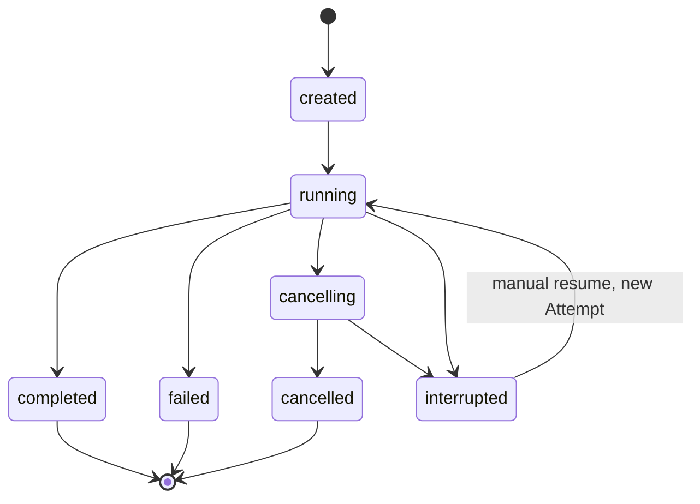

# 05. 持久化 Runtime：让 Agent 工作可控、可恢复、可审计

## 1. 为什么不能只写一个 while 循环

最简单的 Agent demo 通常是：模型回答 → 如果要工具就调用 → 把结果喂回模型 → 直到结束。生产诊断会遇到：

- API 进程中途退出；
- 模型或 Provider 超时；
- 用户取消；
- 多个调查同时运行；
- 同一个调查被重复启动；
- 工具已经成功但响应丢失；
- 恢复时配置已经改变；
- 前端断线重连；
- 需要证明“重放没有重新调用模型”。

DiagOps 的 `backend/runtime` 就是为这些问题存在的。

## 2. 四个核心对象

| 对象 | 解释 | 类比 |
| --- | --- | --- |
| RuntimeRun | 一次完整执行及冻结配置 | 一张工单 |
| RuntimeAttempt | 一段连续拥有执行权的尝试 | 某位员工的一次接单 |
| RuntimeEvent | 运行中发生的不可变事实 | 工单时间线 |
| RuntimeCheckpoint | 某阶段完成后的可恢复边界 | 游戏存档点 |

一个 Investigation 可以有多个 Run；一个 Run 因中断和恢复可以有多个 Attempt；每个阶段会产生事件和 Checkpoint。

## 3. Run 状态机



注意：

- `cancelling` 表示取消已请求但还在安全收口；
- `interrupted` 不是失败终态，可以在条件满足时人工恢复；
- `cancelled` 是终态，不能恢复；
- 启动审计发现 lease 过期只标记 interrupted，不会自动调用 Agent 或 Tool。

## 4. Attempt 和 lease

Run 不是由“某个线程”永久拥有。每次连续执行创建一个 Attempt，并由 lease 表示临时所有权：

- `lease_owner`：当前执行者；
- `lease_expires_at`：租约到期时间；
- `lease_version`：防止旧执行者晚到写入。

Coordinator 定期续租。每次重要操作前通过 `check_execution` 验证：

- lease 仍属于自己；
- version 没变化；
- 没有取消；
- deadline 未过。

如果旧 Provider 调用在 lease 丢失后才返回，结果会被 fence 拦住，不能推进状态。这叫防止 late result。

## 5. 阶段为什么是持久化契约

V11 阶段表定义在 [runtime/phases.py](../../backend/runtime/phases.py)：

```text
intake
evidence_collection
lead_planning
investigator_round_1
critic_review
investigator_round_2
critic_reconciliation
lead_adjudication
result_validation
report_generation
finalize
```

可选的 Round 2 即使不执行，也会写 `skipped` 阶段和 Checkpoint。这样恢复时不会猜“是还没做，还是决定跳过”。

阶段提交使用 compare-and-set 条件：

- 预期上一阶段必须匹配；
- 预期 checkpoint ID 必须匹配；
- 下一阶段必须符合该执行版本的固定顺序。

因此重复提交和越级提交都会失败。

## 6. PhaseExecutor 与 V11Runtime 的分工

`DiagnosisPhaseExecutor` 负责把 Runtime phase 映射到业务处理器：

- V10 使用旧的确定性 RCA 处理器；
- V11 使用专门的 V11 intake/evidence/report/finalize 语义；
- Agent 阶段转交 `V11Runtime.run_phase`；
- 产出 `PhaseOutput` 和 `BusinessMutation`，而不是随意写数据库。

V11Runtime 负责本阶段的 Agent 业务；RuntimeCoordinator 负责阶段顺序、lease、事件、deadline、Checkpoint 和终态。两者互不替代。

## 7. 为什么要单写入 RuntimeWriter

Agent 和 Provider I/O 可以并行，但 SQLite 同时多写容易冲突，也容易出现：

- Evidence 已写，ToolCall 没写；
- Checkpoint 已写，业务投影没写；
- 事件先后顺序错误；
- 取消后旧结果覆盖新状态。

[RuntimeWriter](../../backend/runtime/writer.py) 使用有界队列串行执行短事务。外部 I/O 不进入写入队列，避免慢模型堵塞数据库；只有已准备好的提交命令进入队列。

一次 phase commit 可以原子包含：

- Investigation 业务投影；
- Plan、Tasks、Findings、Review、Report；
- Runtime Event；
- ResumeState；
- Checkpoint；
- 当前 phase 与预算更新。

## 8. Checkpoint 保存什么

Checkpoint 不复制所有日志正文，只保存恢复控制信息和摘要：

- 已完成 Evidence IDs；
- 已完成 Finding IDs；
- Review/Report IDs；
- 剩余 Tool/Token/model-turn 预算；
- 成功工具的 idempotency keys；
- 已完成阶段；
- 状态摘要和业务投影摘要。

恢复时既验证 checkpoint 自身摘要，也验证它引用的 durable 业务对象仍存在且完全一致。数据库内容被篡改或部分丢失会变成 `checkpoint_invalid` / `contract_integrity`，而不是带病续跑。

## 9. 恢复怎样工作

```text
找到 interrupted Run
  → 校验执行契约、owner、deadline 和 Checkpoint digest
  → 计算 ResumeState 与下一个 phase
  → 创建新 Attempt
  → 继承原始 deadline 和剩余预算
  → 复用已成功的 Tool 结果
  → 从下一个未完成阶段继续
```

恢复不是新 Run，所以：

- 不重置 Token 或工具预算；
- 不重置原始 deadline；
- downtime 不退款；
- 不重新执行已提交阶段；
- 不把旧 V10 Run 换成 V11 语义。

## 10. Replay 与 Rerun 的区别

这是常见面试题。

| 操作 | 是否调用模型/工具 | 目的 |
| --- | --- | --- |
| Resume | 可能，只继续未完成部分 | 从中断恢复 |
| Replay | 绝不调用 | 验证持久化事件与投影能否一致重建 |
| Live rerun | 会调用 | 用相同或新配置重新调查 |
| Diff | 不调用 | 比较两个 Run 的结构化结果 |

Replay 消耗零模型 Token。它检查事件序列缺口、非法状态迁移、引用错误、Checkpoint 篡改和冻结投影一致性。把“重新执行一次”叫 replay 是不诚实的，因此项目严格区分。

## 11. 取消怎样保证安全

取消不是直接 `task.cancel()` 后不管：

1. Run 进入 `cancelling`；
2. Coordinator 的执行检查使新动作停止；
3. 打断正在等待的 Agent/Tool；
4. running 的 AgentExecution 和 ToolCall 收口为 cancelled/interrupted/failed；
5. 已越过 durable 边界的结果保留；
6. lease 和 Attempt 收口；
7. Run 最终进入 `cancelled`。

工具线程可能无法在 Python 层瞬间终止，所以返回后必须再次检查执行 fence，晚到结果不能提交。

## 12. 硬 deadline

deadline 从 Run 进入 `running` 的 UTC `started_at` 开始，而不是每个 phase 单独计时。每次进程运行时，把剩余 UTC 时间换成本地 monotonic 倒计时，避免把不可跨重启的单调时钟写入数据库。

调用前会计算：

```text
实际调用超时 = min(该类调用配置上限, Run 剩余时间)
```

如果已经没有足够时间，调用不会开始。重试退避也受同一个 deadline 约束。

## 13. SSE 实时事件为什么可靠

前端使用 Server-Sent Events 查看时间线。RuntimeEvent 有每个 Run 单调递增的 `sequence`。

重连流程：

1. 客户端带 `Last-Event-ID`；
2. 服务端先订阅 live 通知；
3. 再从 SQLite 查询缺失的 durable events；
4. 按 sequence 去重；
5. live 队列只负责唤醒，真实内容仍从数据库补齐。

“先订阅再补历史”避免补历史期间新事件恰好到达而丢失。慢客户端队列溢出只关闭它自己的流，不阻塞 Writer 或其他 Run。

## 14. 并发与隔离

- `RuntimeManager` 的 Semaphore 限制同时运行的 Run；
- `RunStepGate` 限制单 Run 内并行步骤；
- 每个 Run 的记录、budget、event 和 trace 按 Run ID 隔离；
- 同一 Investigation 的 active Run 冲突返回 409；
- 单 Writer 保证 SQLite 短事务顺序；
- lease/version 防止两个执行者同时拥有同一 Run。

## 15. 执行契约为什么比配置文件更权威

V11 Run 创建时冻结：

- execution contract version 与 authority mode；
- Provider、model、API mode、endpoint identity；
- compatible endpoint 准入时的 capability artifact identity；
- prompt、tool manifest、skill catalog identity；
- Token、Tool、turn、每个 Investigator 的工具上限、Investigator 数、round、retry、timeout 和 topology 限制。

API key 不进入契约；endpoint 保存无凭证的规范化哈希身份。V11 phase profile 由持久化的 execution contract version 选择，`max_parallel_steps_per_run` 仍来自当前 Runtime 设置；Provider profile/source package identity 则在特定 Provider 或 benchmark 工件中另行冻结，不是每个产品 Run contract 的通用字段。恢复、Replay、Diff 和 Benchmark 都先验证各自适用的契约/工件身份。当前环境配置不能覆盖历史 Run 的语义。

## 16. 面试回答模板

“我没有把 Agent 做成一个不可恢复的 while 循环，而是复用了版本化 durable Runtime。一次 Investigation 可有多个 Run；Run 通过 lease 和 Attempt 管理执行所有权，按持久化执行契约选择 V10 或 V11 phase profile。每个阶段用单 Writer 在一个短事务里提交业务投影、事件和 Checkpoint。Checkpoint 保存引用、剩余预算和幂等工具键，并用 digest 验证。取消、超时和 lease 丢失都有 fence，晚到结果不能写入；恢复继承原 deadline 和预算，Replay 完全不调用模型或工具；SSE 以数据库序列为真相源。这使 Agent 流程具备普通生产作业需要的可靠性。”
