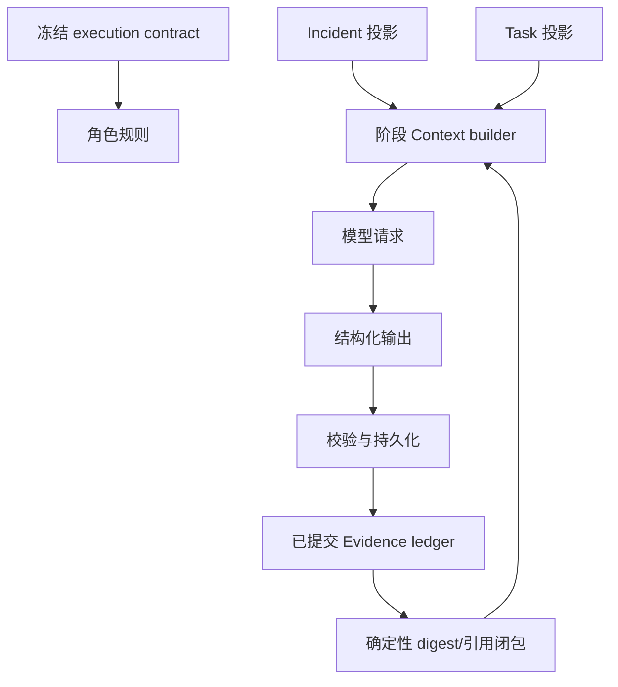

# 16. 上下文工程与压缩：从 Token 到可恢复记忆

## 1. 先把四个容易混淆的词分开

| 词 | 含义 | 在 Agent 系统里的问题 |
| --- | --- | --- |
| Prompt | 发送给模型的指令文本，通常包含角色规则和任务规则 | 写得越长不一定越好，重复规则会挤掉证据 |
| Context | 本次模型请求可见的全部输入：prompt、任务、证据、工具结果、历史状态 | 它同时是能力边界、权限边界和成本账单 |
| Context window | 模型一次请求能处理的输入/输出上限 | 超限会失败，接近上限还会出现注意力衰减 |
| Working memory | 为完成当前任务保留的短期状态 | 不能把它误当作跨 Run 的永久知识 |

可以把一次请求想成一个有限大小的白板。Prompt 是白板顶部的工作规则，Context 是白板上所有内容，Evidence 是贴在白板上的有编号材料。压缩不是把材料“变成真理”，而是在白板不够大时选择哪些材料继续可见。

Token 是模型计费和窗口限制的近似计量单位。英文、中文、JSON 标点和工具 schema 的 token 密度不同，所以字符数只能做粗估。一个简化的成本模型是：

```text
一次请求成本 ≈ 输入 token × 输入单价
             + 输出 token × 输出单价
             + 工具/检索/重试的外部成本
```

## 2. 为什么“把全部历史塞进去”会失败

### 2.1 窗口溢出只是最明显的失败

当历史工具结果、长日志和重复 schema 累积到窗口上限时，请求直接被拒绝。更隐蔽的情况是还没有超限，但模型把关键证据埋在大量相似条目中，导致：

- 把最后出现的症状当成第一原因；
- 忽略位于中间位置的反证（常称 *lost in the middle*）；
- 重复调用已经查过的工具；
- 把 Provider 返回的自然语言误当成系统指令；
- 在不同 Run 的历史之间串用 Evidence ID；
- 因输入变长而增加延迟和费用。

因此上下文工程的目标不是单纯“压缩到更小”，而是同时满足：

```text
足够的诊断覆盖 × 正确的来源/时间/实体归属 × 可复现 × 在预算内
```

### 2.2 上下文是权限，不只是信息

模型只能使用 Runtime 投影给它的字段。没有被投影的 `runtime_run_id`、数据库主键、内部 benchmark 标签和凭证不应该通过“顺便放进上下文”暴露。一个常见反模式是把完整 ORM 对象直接 `model_dump()` 后塞给模型：这会同时扩大泄漏面、幻觉面和 token 账单。

## 3. DiagOps 当前的上下文分层

V11 不使用一个巨大的共享对话，而是按阶段构造有界投影。可以用下图理解数据流：



当前代码中的主要投影如下：

| 角色/阶段 | 可见内容 | 代码锚点 | 明确不放入上下文的内容 |
| --- | --- | --- | --- |
| Lead planning | service、environment、severity、title、必要 description、剩余预算、Skill 目录 | `V11Runtime._lead_prompt`、`_live_incident_prompt_projection` | 数据库 ID、兄弟 Agent 对话、完整 Evidence 正文 |
| Round 1 Investigator | 自己的 task 目标、有限 Evidence digest、冻结工具面、剩余预算 | `V11Runtime._investigator_prompt`、`_live_task_prompt_projection` | 兄弟 Investigator 的 Finding 和候选 |
| Critic | 候选、Finding、候选引用链对应的 usable Evidence、七项检查规则 | `_critic_prompt`、`_critic_evidence`、`_usable_critic_evidence` | Provider 工具、无关 Evidence、事故 description（compact live 路径） |
| Lead adjudication | Critic accepted refs 和剩余缺口；live 路径由服务端机械投影 | `_lead_adjudication_context` | 新的自由取证入口 |

`_event_projection` 是兼容/测试路径的完整投影；`_live_*_prompt_projection` 是真实 live 请求的紧凑投影。阅读源码时要先确认当前调用走哪条路径，不能把测试适配器的字段当成生产 prompt 合同。

## 4. Evidence digest 是“确定性抽取”，不是摘要模型

### 4.1 当前选择算法

`_select_evidence_digest` 的默认调用参数是 `max_per_kind=2`、`max_total=4`。它只选择 `success` 或 `partial` Evidence，完整 ledger 仍在数据库中。存在指标 `signal_type` 和实体时，算法大致为：

1. 按 Evidence 的实体分组；
2. 每个实体内按 `signal_type`（例如 `cpu`、`latency`、`socket`、`disk`、`error`）取代表项；
3. 实体按 `change_score` 和稳定的实体名排序，最多覆盖前几个实体；
4. 在实体队列之间轮转，避免某个实体的 CPU 条目占满全部名额；
5. 预留非指标位置给日志、Trace、依赖等证据；
6. 不带 signal family 的旧 Evidence 退回按 `kind` 轮转；
7. 分数相同再用 timestamp 和 ID 作稳定 tie-break。

这不是 LLM 生成的摘要，也不会改写 Evidence 的 `summary` 或 `payload`。它只决定本轮 prompt 看见哪些已有记录。

### 4.2 一个完整例子

假设 ledger 有 16 条记录：

```text
checkout/cpu       change_score=0.95
checkout/latency   change_score=0.91
checkout/socket    change_score=0.83
checkout/error     change_score=0.80
payment/cpu        change_score=0.79
payment/socket     change_score=0.77
connection-refused 日志
trace 首个 error span
其余 8 条重复曲线或 failed provider 记录
```

一个可能的 digest 是：

```text
1. checkout/cpu       (metric_trend, signal_family=cpu)
2. checkout/socket    (metric_trend, signal_family=socket)
3. connection-refused (log_pattern)
4. trace 首个 error span (trace_error)
```

如果只做全局 Top-4，前三项可能全是同一实体的指标，模型就没有足够材料区分“资源饱和”和“连接被拒绝”。digest 只有四条并不代表其余十二条被删除；Investigator 仍可调用冻结的九个只读工具补查。

### 4.3 Critic 的引用闭包

Critic 不需要重新看到整个 Run。`_critic_evidence` 从候选、Finding、已有 Assessment 中收集所有被引用的 Evidence ID，只把对应记录投影给 Critic；若没有可解析的引用，才保守退回全量输入。随后 `_usable_critic_evidence` 再过滤为当前 Run 的 `success/partial` 记录。

这有两个重要性质：

- 选择依据来自已经持久化的引用，不由 Critic 自己“挑证据”；
- 压缩不能产生新的 Evidence ID，引用闭包只会减少输入，不会改写候选。

## 5. 工具 schema 也需要上下文预算

`AdaptiveToolSession._compact_json_schema` 会移除工具 schema 中重复的 `title`、长描述和长度元数据，只保留类型、枚举、必填、`additionalProperties` 等语义。`_model_query_schema` 还会移除由服务端确定的公共字段（时间窗、`reason`、`limit`），并由 `_server_query_defaults` 注入事故窗口的安全默认值。

```text
模型看到：{ metric_names, aggregation, instance }
服务端补齐：{ start_time, end_time, reason, limit }
服务端再次执行：完整 Pydantic QueryModel 校验
```

压缩 schema 只影响发送给模型的描述，不影响服务端契约。任何人若把它改成“模型可以省略校验字段”，就是错误理解。

## 6. Token 估算、预留与结算

V11 的 `_estimate_model_input` 对 prompt、context、工具 schema 和 output schema 做启发式估算，并按 CJK、ASCII 和 JSON 标点分桶。它的职责是“在请求前判断预算是否可能足够”，不是替代模型厂商 tokenizer 的精确计数。

请求生命周期是：

```text
估算输入 → 在锁内预留输入+输出上限 → 通过 deadline/lease fence
→ 发出请求 → 读取可信 usage → 按实际结算 → 释放未用的输出预留
```

`_ModelUsageAccumulator` 去重同一 response 对象，避免 SDK 生命周期回调和最终结果重复计费。没有可信 usage 时只能使用受审计的 fallback 估算，不能把消耗记录成零。并行 Investigator 的预留会按尚未占用的调查槽位分配，避免第一个请求吃光全部 token。

## 7. 常见压缩方式与适用边界

| 方法 | 做法 | 优点 | 主要风险 | DiagOps 现状 |
| --- | --- | --- | --- | --- |
| 截断 | 取前 N/后 N 条 | 最简单、零模型成本 | 丢掉反证和时间线 | 仅在各字段有界时使用 |
| 滑动窗口 | 保留最近一段历史 | 适合连续聊天 | 早期根因消失 | 未作为诊断真相机制 |
| Extractive 选择 | 按分数、实体、kind 选原文 | 可追溯、不会改写事实 | 可能缺少跨条目关系 | `Evidence digest` 已实现 |
| Abstractive 摘要 | 让模型重述旧上下文 | 节省大量 token | 摘要幻觉、引用丢失 | 未实现通用摘要 Agent |
| 层级摘要 | 事件→阶段→Run 多级摘要 | 长任务可扩展 | 误差会层层累积 | 设计候选，尚无持久化契约 |
| 检索替代 | 只召回相关记录 | 数据规模大时有效 | embedding/ACL/新鲜度复杂 | `lookup_memory` 不是向量 RAG |
| 服务端 compaction | API 在阈值处生成 opaque compaction item | 不必自行维护摘要算法 | 供应商锁定、难人工审计 | 未接入 V11 Chat Completions 路径 |
| Prefix/prompt cache | 缓存稳定前缀的 KV/输入 | 降低延迟和输入成本 | cache key、租户和 prompt 漂移 | 未作为业务正确性依赖 |

## 8. 前沿实现：何时用服务端 compaction，何时自己压缩

截至 2026-08-30，主流 API 已把上下文管理做成一等能力：

- OpenAI Responses API 支持 `context_management` 的 compaction threshold。跨过阈值后服务端生成 compaction item；调用方继续携带该 item，且可以丢弃其之前的输入来降低长尾延迟。它是 opaque 状态，不能当作人可读的审计摘要。详见 [OpenAI Compaction](https://platform.openai.com/docs/guides/compaction)。
- Anthropic API 的 compaction/context editing 支持在服务端压缩旧对话、清理旧 tool result 或 thinking block。服务端仍保留客户端维护的完整历史，策略和 beta/模型支持矩阵会变化，详见 [Compaction](https://docs.anthropic.com/en/docs/build-with-claude/compaction) 与 [Context editing](https://docs.anthropic.com/en/docs/build-with-claude/context-editing)。
- OpenAI Agents SDK 提供 Sessions、上下文历史和 tracing，但 Session 只是历史管理抽象；它不会替你的领域证据引用契约。见 [Sessions](https://openai.github.io/openai-agents-python/sessions/)。

对于 DiagOps，不能直接把 opaque compaction 当成诊断账本。安全的演进是保留两个层次：

```text
不可压缩的事实层：Evidence ID、时间、实体、状态、scope、来源哈希
可压缩的叙事层：阶段摘要、工具观察、重复解释、已否决的冗长文字
```

如果未来接入服务端 compaction，仍要在本地持久化事实层、compaction item 的哈希、触发阈值、模型/endpoint 身份和恢复位置；不能只保存供应商返回的 opaque 字节。

## 9. 自己实现“可引用压缩”的教育版算法

下面是教育版伪码，不是对当前仓库新增的运行时代码。关键点是摘要器只能抽取已存在事实，不能自行发明根因：

```python
def build_context(incident, task, evidence, budget_tokens):
    fixed = project_incident(incident) + project_task(task)
    facts = select_evidence_digest(evidence, max_total=4)
    context = {"incident": fixed.incident, "task": fixed.task, "evidence": facts}

    if estimate_tokens(context) <= budget_tokens:
        return context

    # 先丢可重建的冗余，不丢 ID、时间、实体和状态。
    context["evidence"] = shorten_summaries(facts, keep_fields={
        "id", "kind", "observed_at", "scope_entity_ids", "signal_family"
    })
    if estimate_tokens(context) <= budget_tokens:
        return context

    # 最后才生成带引用的结构化阶段摘要；失败时宁可返回缺口。
    summary = summarize_only_committed_facts(facts)
    validate_summary_ids(summary, allowed={item.id for item in facts})
    context["evidence_summary"] = summary
    return context
```

一个合格的摘要 schema 至少应包含：`fact_ids`、`time_range`、`entities`、`observations`、`contradictions`、`gaps`、`uncertainty`。摘要验证规则应包括：引用 ID 全部存在且同 Run、时间窗不扩大、实体不新增、`gaps` 不被改写成 `pass`。摘要器失败时应降级为 `inconclusive` 或继续工具取证，而不是静默使用无引用的自由文本。

## 10. 压缩质量怎样测

只报告“省了多少 token”是不够的。建议为每个压缩版本记录：

```text
token_saving = 1 - compressed_tokens / original_tokens
citation_recall = 保留下来的关键 Evidence ID 数 / 关键 ID 总数
entity_scope_recall = 保留正确实体的案例数 / 案例总数
faithfulness = 摘要事实可由原 ledger 支持的比例
lost_in_middle_rate = 关键反证位于中间时的漏检率
latency_p95、cost_per_run、invalid_output_rate、inconclusive_rate
```

测试应固定同一 incident、模型、工具 manifest 和随机种子，比较“无压缩、当前 digest、候选 compactor”三组；回归重点放在反证、跨实体、failed Evidence 的 Gap 语义和 Evidence ID 完整性。压缩器本身也要做 property-based 测试：任意输入都不能生成不存在的 ID 或扩大 scope。

## 11. 现状与演进边界

**Implemented**：阶段化投影、确定性 Evidence digest、Critic 引用闭包、工具 schema 压缩、输入估算与 durable reservation、同 Run/同 owner 校验。

**Partial**：当前只有抽取/投影，没有通用的 abstractive compaction；输入估算不是厂商 tokenizer；Prompt cache 不是正确性依赖。

**Not implemented**：服务端 compaction 接入、可审计的层级摘要表、跨会话语义记忆压缩、KV cache 管理和自动压缩质量门。

只有在评测显示 context size 是主要瓶颈后，才建议按“事实层不变、叙事层可压缩”的路线增加这些能力。

## 12. 面试回答模板

> 我把上下文当成能力和权限边界，而不是把数据库整行塞给模型。V11 按角色做投影：Lead 看事故和预算，Investigator 看自己的任务与最多四条确定性 Evidence digest，Critic 只看候选引用闭包。digest 按实体、signal family、kind 和稳定 tie-break 抽取原记录，绝不是 LLM 摘要，完整 ledger 仍在 SQLite。工具 schema 也会去掉服务端已知字段，输入预算先估算并 reservation，之后用真实 usage 结算。若以后接入 OpenAI/Anthropic 的 server-side compaction，我会把 Evidence ID、时间、scope、状态和 provenance 留在本地不可压缩事实层，只压缩可重建叙事，并用 citation recall、faithfulness、lost-in-middle 和成本延迟做回归门。

## 13. 学习核对清单

- [ ] 能解释 Prompt、Context、Window、Working memory 的区别。
- [ ] 能从 `V11Runtime._select_evidence_digest` 说出四条 digest 的选择逻辑。
- [ ] 知道 digest 不是摘要模型，Critic 的引用闭包也不是删库。
- [ ] 能解释为什么 `_estimate_model_input` 只是启发式，以及 reservation 为什么要在请求前完成。
- [ ] 能比较截断、抽取、摘要、检索、compaction 和 cache 的风险。
- [ ] 能设计一个保留 Evidence ID 且禁止新结论的摘要 schema。
- [ ] 能用指标证明压缩提升了质量而不只是减少 token。

## 14. 参考资料

- [OpenAI Compaction](https://platform.openai.com/docs/guides/compaction)
- [Anthropic Compaction](https://docs.anthropic.com/en/docs/build-with-claude/compaction)
- [Anthropic Context editing](https://docs.anthropic.com/en/docs/build-with-claude/context-editing)
- [OpenAI Agents SDK Sessions](https://openai.github.io/openai-agents-python/sessions/)
- [Anthropic Effective context engineering](https://www.anthropic.com/engineering/effective-context-engineering-for-ai-agents)
- 仓库实现：[V11 Runtime](../../backend/diagnosis/v11_runtime.py)、[AdaptiveToolSession](../../backend/diagnosis/adaptive_tools.py)、[Runtime contract](../../backend/domain/runtime.py)。
