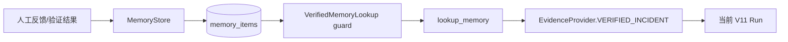

# 18. Agent Memory 与 RAG：可复用知识怎样不污染诊断

## 1. Memory、Context、RAG 不是同一个东西

- **Working memory**：当前 Run 的任务、工具结果和未完成状态；通常随 Checkpoint 恢复。
- **Episodic memory**：某一次历史事故的经过，例如“某服务在某时刻因连接池耗尽失败”。
- **Semantic memory**：跨事故归纳的稳定知识，例如服务依赖关系或故障手册。
- **Procedural memory**：做事的方法，例如先查 first failure timeline，再查 Trace。
- **RAG（Retrieval-Augmented Generation）**：运行时从外部索引召回资料，作为本次 Context 的输入；它是一条检索流程，不等于某一种数据库。

最容易犯的错误是把“把历史文本放入 prompt”称为 RAG。真正的 RAG 至少包含：写入/清洗、索引、召回、过滤、重排、注入、引用和评测；缺少权限与新鲜度控制的向量搜索，往往只是一个幻觉放大器。

## 2. DiagOps 当前的 Memory 语义

当前项目采用受保护的关系型 verified memory，而不是 embedding/vector RAG：



相关代码：

- `backend/domain/memory.py`：`MemoryItem`、`MemoryType`、`MemoryVerificationStatus`；
- `backend/memory/store.py`：保存和记录反馈；
- `backend/tools/provider_tools.py`：`VerifiedMemoryLookup` 与 `lookup_memory`；
- `backend/db/schema.py`、`repositories.py`、`sqlite_repository.py`：持久化与按 service/environment 查询；
- `backend/api/investigations.py`：反馈与人工 verification API。

### 2.1 写入不是自动“学习”

`MemoryStore.record_feedback` 会把人工反馈保存为 `HUMAN_FEEDBACK`，默认是 `unverified`。只有具备 `verified_at`、`verified_by`、`source_investigation_id` 和 `root_candidate_id` 等 provenance 的记录，才有资格被 `VerifiedMemoryLookup` 转成可引用的 `VERIFIED_INCIDENT` Evidence。模型自己写出的摘要不会自动升级成 verified memory。

### 2.2 读取 guard 的完整条件

`VerifiedMemoryLookup` 至少检查：

1. verification status 必须是 `verified`；
2. 来源 investigation 与 root candidate 仍存在；
3. `created_at` 和 `verified_at` 不得晚于当前事故开始时间，防止未来信息泄漏；
4. 当前 investigation 以及其 `source_investigation_id` 祖先不能被读回，防止 rerun 自己引用自己的答案；
5. service/environment 由当前 Investigation 固定，不由模型任意传入；
6. 可选 `affected_entity`、`failure_mechanism` 和 `limit` 经过 `MemoryQuery` 校验；
7. 结果带 `VerifiedIncidentPayload`、scope 和 provenance，作为新的 Evidence ID 参与引用链。

“空结果”是显式 success，不代表系统找到了“没有历史”；它只表示当前 guard 下没有可用记录。

## 3. 典型 RAG pipeline 应该怎样设计

如果未来数据规模超过关系型筛选能力，可以把 RAG 拆成明确阶段：

```text
采集 → 脱敏/去密 → 切块 → 生成 embedding/倒排索引
     → ACL/租户/时间过滤 → hybrid 召回 → rerank
     → 证据投影与引用 → 模型推理 → 反馈/遗忘
```

每一阶段的输入输出都应带：`tenant_id`、`source_id`、`source_version`、`observed_at`、`valid_until`、`access_policy` 和 `content_hash`。embedding 只能帮助相似度排序，不能替代事实来源或权限检查。

### 3.1 召回方式比较

| 方式 | 适合 | 优点 | 风险/代价 |
| --- | --- | --- | --- |
| SQL/关键词 | 服务、环境、故障分类精确过滤 | 可解释、便宜、易审计 | 同义表达召回差 |
| 倒排 BM25 | 日志/手册中的词匹配 | 结果可解释、无需 embedding | 对语义改写不敏感 |
| 向量 ANN | 相似事故、长文语义检索 | 召回同义案例 | ACL、漂移、投毒和索引运维复杂 |
| Hybrid（BM25+向量） | 既要精确字段又要语义相似 | 兼顾 recall/precision | 权重和融合需评测 |
| Reranker | 候选较多且需要细粒度排序 | 提升 top-k 质量 | 额外延迟和模型成本 |

建议顺序是先做精确过滤，再做语义召回，最后重排；不能先向量搜索再补权限，否则可能在过滤前泄漏标题或摘要。

## 4. 记忆投毒、陈旧和冲突

### 4.1 投毒（memory poisoning）

攻击者可以提交一条看似合理的事故反馈，让未来 Agent 永久引用错误结论。防御需要：

- 人工验证门，模型输出默认为 unverified；
- 来源 candidate、Evidence ID 和验证人可追溯；
- 允许 `rejected` 和撤销，不做不可逆晋升；
- 记录写入者、时间、版本和 hash；
- 对异常高频、跨租户相似文本做审计；
- 把历史内容当 data，不能执行其中的指令。

### 4.2 陈旧（staleness）

服务拓扑和配置会变化。每条记忆应有时间范围或 TTL，并在召回时比较当前 service catalog/version。过期记忆可作为“历史参考”而非正向证据，必须显式标注不确定性。

### 4.3 冲突（conflict）

两条 verified memory 可能对同一机制给出不同结论。不要让最后写入的记录覆盖前一条；应把它们作为独立 Evidence，保留版本、验证依据和冲突标记，交给 Critic 做时间/实体/机制比较。

## 5. Memory 与其它技术的选择

| 需求 | 首选 | 不应直接替代 |
| --- | --- | --- |
| 当前 Run 的工具结果 | durable Evidence ledger + Checkpoint | 向量库 |
| 精确服务/环境过滤 | SQL/关系索引 | embedding 相似度 |
| 历史相似事故 | verified episodic memory；规模大再 hybrid RAG | 直接 fine-tuning |
| 稳定领域规则 | 版本化 service catalog/Skill | 无来源的自由文本记忆 |
| 改变模型行为 | 评测后 prompt/模型微调 | 把未经验证反馈塞进 context |

Fine-tuning 是改变模型参数，RAG 是每次请求补充输入；前者不能提供实时 provenance，后者不能保证模型一定遵守证据契约。诊断系统通常先用可撤销、可审计的 RAG，再考虑微调。

## 6. 教育版 hybrid retriever 伪码

以下代码是演进设计示例，不是当前仓库实现：

```python
def retrieve_memory(event, query, k=8):
    # 先做不可绕过的租户、service、environment、时间和 verification 过滤。
    candidates = sql_filter(
        service=event.service,
        environment=event.environment,
        status="verified",
        observed_before=event.started_at,
        exclude_investigation_lineage=current_lineage(),
    )
    if not candidates:
        return []

    lexical = bm25(candidates, query.text, limit=4 * k)
    semantic = vector_search(candidates, embed(query.text), limit=4 * k)
    merged = reciprocal_rank_fusion(lexical, semantic)
    ranked = rerank(query, merged[:4 * k])
    return [project_as_evidence(item) for item in ranked[:k]]
```

`project_as_evidence` 必须生成新的本 Run Evidence ID，并保留源记忆 ID、内容 hash、验证时间和匹配理由；不能直接把向量库原始文本拼接进 prompt。

## 7. 记忆质量如何评测

需要同时测检索和诊断：

```text
Recall@k / Precision@k       召回是否包含人工认可的相关案例
ACL leakage rate             是否召回其它租户/未来/当前 Run 记录
staleness rate               过期记忆占比
citation precision          模型引用的记忆是否真的来自召回结果
faithfulness                记忆摘要是否可由源 candidate/Evidence 支持
conflict detection recall   已知冲突是否被标出
diagnosis delta              引入 memory 后 Top-1/abstention 是否改善
cost/latency                 检索与 reranker 的额外代价
```

离线测试要有“无 memory、只有 unverified、含投毒/未来记录、含冲突记录”四类对照。任何加入向量库的方案都必须证明它提高了 paired case 的证据质量，而不是仅仅让 prompt 变长。

## 8. 推荐的演进顺序

1. 先完善当前 relational verified guard 的审计、撤销和 TTL；
2. 为 `lookup_memory` 增加召回命中/过滤原因指标，但不暴露敏感正文；
3. 当数据量和 miss rate 有实测瓶颈时，增加倒排索引；
4. 再以离线 shadow 方式加入 hybrid embedding+rereank，保留 SQL guard；
5. 通过固定 manifest、source hash 和评测门后，才考虑切换默认路径。

## 9. 现状标签

**Implemented**：MemoryItem 关系存储、人工反馈、verified provenance、service/environment 固定范围、时间与 lineage guard、`lookup_memory` Evidence 投影。

**Partial**：Memory 可作为 V11 九工具之一，但默认没有 verified 记录时只返回显式空 success；当前没有专用的 memory relevance/TTL dashboard。

**Not implemented**：embedding/vector DB、BM25+向量 hybrid、reranker、自动摘要记忆、跨租户记忆、自动晋升和自动遗忘策略。

## 10. 面试回答模板

> 目前 DiagOps 不把任意历史文本当 RAG，而是用 VerifiedMemoryLookup 从同 service/environment 的关系型记录中读取 verified memory。它检查验证 provenance、时间不晚于当前事故、排除当前 Run 及祖先 lineage，并把结果重新投影成带 provenance 的 Evidence ID；人工反馈默认 unverified，模型不能自动“学习”。如果规模需要向量检索，我会先做 SQL/ACL/时间过滤，再 hybrid 召回和 rerank，最后只注入可引用 Evidence，并用 recall@k、ACL leakage、staleness、citation faithfulness 和 paired diagnosis delta 证明收益。

## 11. 学习核对清单

- [ ] 能区分 working/episodic/semantic/procedural memory 与 RAG。
- [ ] 能说出 `VerifiedMemoryLookup` 的至少五条 guard。
- [ ] 能解释为什么“空 memory”是显式 success，而不是 mock 根因。
- [ ] 能比较 SQL、BM25、向量、hybrid、reranker 的边界。
- [ ] 能设计防 memory poisoning、未来信息泄漏和陈旧记忆的策略。
- [ ] 能列出 RAG 的检索质量和下游诊断质量指标。

## 12. 参考资料

- [LangGraph memory concepts](https://docs.langchain.com/oss/python/langgraph/memory)
- [OpenAI Agents SDK Sessions](https://openai.github.io/openai-agents-python/sessions/)
- [OpenAI Agents SDK Agent memory](https://openai.github.io/openai-agents-python/sandbox_agents/)
- 仓库实现：[MemoryStore](../../backend/memory/store.py)、[Memory domain](../../backend/domain/memory.py)、[VerifiedMemoryLookup](../../backend/tools/provider_tools.py)。
