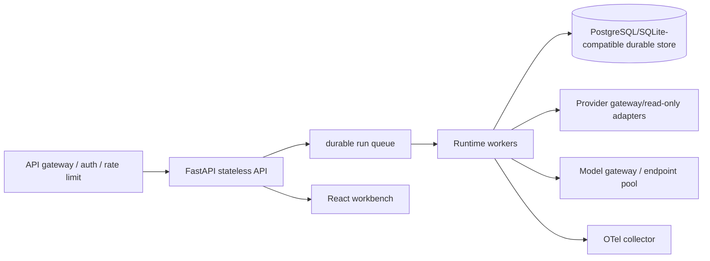

# 25. Agent 部署、扩展与上线运维

## 1. 当前可运行形态：本地优先、默认关闭模型

`config/diagops.yaml` 的事实是：

```text
SQLite: enabled（data/diagops.db）
Runtime: enabled
Agents SDK: disabled by default
mock/file providers: enabled for local development
Prometheus/local package: opt-in
OpenTelemetry: disabled by default
```

启动时 `backend/services/container.py` 作为组合根创建 Settings、Repository、ProviderRegistry、ToolRegistry、V11/legacy runtime、Runtime Store/Writer/Manager、Replay/Diff 和 Telemetry。FastAPI 关闭时先停止新调度、等待已接受写入、flush telemetry，再关闭数据库。

这不是“已经是多节点生产平台”的声明。它是一个能在无凭证、可重复的本地环境验证 Agent/Runtime 契约的基础。

## 2. 目标生产拓扑（设计参考）



这是未来演进图，不是当前仓库已实现的组件。核心原则保持不变：生产 Provider 和 Agent 工具只读，Runtime 才拥有预算/状态/恢复权；模型 gateway 不能绕过 ToolRegistry 直接访问生产数据。

## 3. 进程和容器边界

下面三类进程是**目标生产架构的职责拆分**，不是当前仓库已经分出的 API/queue/worker/gateway 服务。当前 `/events` 和 `/investigations/manual` 会等待 `AppContainer.run_investigation` 完成；Runtime-run API 才提供 202 后台启动语义。

### API 进程

- 接收事件、创建 Investigation/Run、查询 public projection、提供 SSE；
- 不在请求线程里无限等待模型；
- 认证、租户和请求大小限制由网关/API 层完成；
- 返回 Run ID，让客户端从 Runtime API/SSE 跟踪。

### Runtime worker

- 获取 Attempt lease，按 frozen contract 执行 phase；
- 所有模型/工具外部调用先做 budget/deadline/fence preflight；
- 只经 RuntimeWriter 写业务投影和事件；
- 进程终止前收口 pending model/tool execution。

### Provider gateway

- 把日志、指标、Trace、发布、依赖和目录归一为 Evidence；
- 处理凭证、网络 egress、超时、响应大小和审计；
- 不把原始 secret 或任意后端语法暴露给模型。

## 4. SQLite 与横向扩展边界

当前 `SQLiteRuntimeStore` + 单 `RuntimeWriter` 适合单节点、有限并发、强事务和本地 replay：

- 单 Writer 降低多 Agent 写入竞争；
- lease/version 防止旧 worker 晚到提交；
- checkpoint CAS 防止 phase 重复/越级；
- memory:// 仅用于测试，不是生产存储。

SQLite 的边界包括写锁竞争、单机磁盘、备份和多进程协调。若实测 active runs、Writer queue、commit p95 或恢复吞吐超过边界，演进顺序应是：

1. 先做 WAL、索引、事务和磁盘监控；
2. 分离只读查询/投影与 Runtime 写入；
3. 再评估 PostgreSQL 等事务数据库和 durable queue；
4. 将 lease、CAS、幂等和 migration 语义重新做故障注入验证。

不能只把 SQLite 换成网络数据库而保留“先这样”的隐式一致性假设。

## 5. 配置与 Secret 管理

配置文件可写非敏感默认值；凭证只从进程环境/正式 secrets manager 读取：

```text
OPENAI_API_KEY                  仅官方 OpenAI 路径
DIAGOPS_AGENTS_API_KEY          仅 generic compatible endpoint
DEEPSEEK_API_KEY                旧/兼容路径按 provider 使用
DIAGOPS_AGENTS_OPENAI_COMPATIBLE_BASE_URL 需 canonicalize
```

不要把 key 写入 YAML、Docker image、日志、Runtime contract、capability artifact 或聊天。`canonicalize_endpoint` 拒绝 userinfo、query/fragment、危险路径和非本机 cleartext HTTP；`endpoint_id` 只保存 URL hash。生产还应使用短期凭证、轮换、最小 scope、审计和网络分区。

## 6. 健康检查与优雅关闭

### 建议的 Readiness（当前未实现完整门禁）

生产环境应只在数据库、RuntimeWriter、Provider 配置和模型 capability（若启用 compatible V11）满足条件后接收新 Run。当前 `AppContainer.startup` 会启动 Writer、审计过期 lease、启动 Manager，但没有实现上述完整 readiness、Provider 完整性或模型 capability 健康门禁。没有认证模型时，Agent 默认 off 的本地实例仍可提供 legacy/offline 能力，但不应声称 V11 live 可用。

### 建议的 Liveness

检查事件循环、Writer worker、RuntimeManager heartbeat 和磁盘；不要把一个慢 Provider 误判成整个进程死锁。

### Shutdown

1. readiness 先置为 false，停止新 Run；
2. RuntimeManager 停止调度并请求安全取消；
3. 等待已接受 Writer 写入收口；
4. 将未完成 Attempt/Tool/Model 标记为 interrupted/failed 的合法类别；
5. flush/shutdown OTel（有界超时）；
6. 关闭 DB/transport。

当前 `AppContainer.shutdown` 已实现有界 runtime shutdown、Writer shutdown 和 telemetry flush；上游 orchestrator 仍需按版本语义区分 V10/V11。

## 7. 发布、能力准入与 canary

Agent 发布不能只做滚动更新，因为 prompt、**有序工具名 manifest**、model adapter 和恢复语义都会影响执行契约。当前 contract 不会独立 hash 同名工具背后的 schema/description/handler；若这些会变，应先扩展 contract/版本与测试。建议流程：

```text
代码/依赖变更
 → 静态检查与 key-free tests
 → offline tool/runtime acceptance
 → model capability certification（精确 endpoint tuple）
 → SS15/shadow paired evaluation
 → 小流量 canary（只读、可观测、人工审查）
 → 通过门后扩大流量
```

旧 Run 必须继续按其 frozen contract 恢复；新版本不能让旧 Run 无声获得新工具或预算。软件回滚可以恢复旧部署，但 Agent 不得通过工具自动回滚/修改生产系统。

## 8. 备份、恢复与 RTO/RPO

定义：

- **RPO**：最多能丢多少已提交事件/Evidence；
- **RTO**：故障后多久恢复接受/继续 Run。

备份必须包含 Investigation、RuntimeRun、Attempt、Event、Checkpoint、ToolCall、Evidence 和 contract/hash；只备份最终报告会破坏 replay 与审计。恢复演练应验证：

1. checkpoint digest 与 durable projection 一致；
2. lease 过期只标记 interrupted，不自动调用 Agent；
3. 新 Attempt 继承剩余预算和成功工具幂等键；
4. late result 被 fence 拒绝；
5. SSE 从 sequence catch-up，不依赖内存队列；
6. 旧历史 schema 仍可读取。

## 9. 多租户与流量治理（当前未实现的生产要求）

若服务多个团队，需要显式加入：

- tenant/project identity 与 Evidence/Memory/Tool scope；
- 每租户 token、工具、并发和费用配额；
- provider credential/endpoint 隔离；
- noisy-neighbor 防护和优先级队列；
- 数据驻留、保留、删除和审计策略；
- tenant-aware cache key、OTel attributes 和 SLO。

不能用 `service` 字段当租户隔离，也不能让模型自行声明 tenant。

## 10. 运维 Runbook 示例

### 模型 endpoint 大量 timeout

1. 观察 `model.failed`/failure_category、p95 和剩余预算；
2. 确认是否为 transport/rate limit，而不是 schema/权限错误；
3. 检查 capability artifact 是否过期；
4. 让新 Run 进入安全降级/人工队列，旧 Run 不更换 endpoint；
5. 供应商恢复后先做认证和 shadow，再恢复 live。

### Writer queue 持续积压

1. 看 SQLite lock/commit latency 与 EventHub subscriber overflow；
2. 先限流新 Run，不让 Agent 继续产生无法持久化的证据；
3. 不直接提升队列上限掩盖磁盘/事务问题；
4. 恢复后核对 checkpoint/projection digest 和未收口 execution。

### 发现疑似 prompt/tool injection

按 [22-安全专题](22-agent-security-threat-model.md) 的响应流程暂停工具/endpoint、保留审计、轮换凭证、隔离 memory，并重新运行对抗测试。

## 11. 现状标签

**Implemented**：本地 FastAPI+SQLite、RuntimeManager/Coordinator/Writer、lease/heartbeat/checkpoint/replay、SSE catch-up、优雅关闭、默认 Agents off、配置级 endpoint/secret 边界、离线/能力认证入口。

**Partial**：可运行的单节点并发和故障注入较完整；生产级 auth、multi-tenant、集中 secrets、队列、分布式数据库、自动 backup/retention 和完整 SLO dashboard 尚未实现。

**Not implemented**：多节点 worker fleet、跨区域灾备、自动滚动/金丝雀控制面、Agent 写操作审批/执行、自动软件回滚编排。

## 12. 面试回答模板

> 当前 DiagOps 是本地优先的单节点系统：Agents 默认关闭，SQLite + 单 RuntimeWriter 支撑事务、checkpoint、lease、replay 和 SSE catch-up。上线 V11 不能只滚动替换容器，因为模型、prompt、tool/Skill manifest 和 retry 语义被 seal 在 execution contract；我会先跑 key-free/offline acceptance，再对精确 endpoint 做 capability certification 和 paired shadow，最后做只读 canary。横向扩展前先测 Writer/SQLite/Provider p95，若有瓶颈再引入队列和网络数据库，并重新验证 CAS、幂等、恢复和租户隔离。凭证只进程/secret manager，Agent 永不获得写工具或自动修复权限。

## 13. 学习核对清单

- [ ] 能解释当前本地拓扑和生产目标拓扑的差异。
- [ ] 能说出 SQLite 单 Writer/lease/checkpoint 的扩展边界。
- [ ] 能设计 readiness、liveness 和 graceful shutdown。
- [ ] 能说明为什么发布前需要 capability、shadow、canary，而不是只看 HTTP 200。
- [ ] 能定义 RPO/RTO 并列出恢复时必须验证的对象。
- [ ] 能列出多租户 Agent 系统必须隔离的身份、预算、凭证和缓存键。
