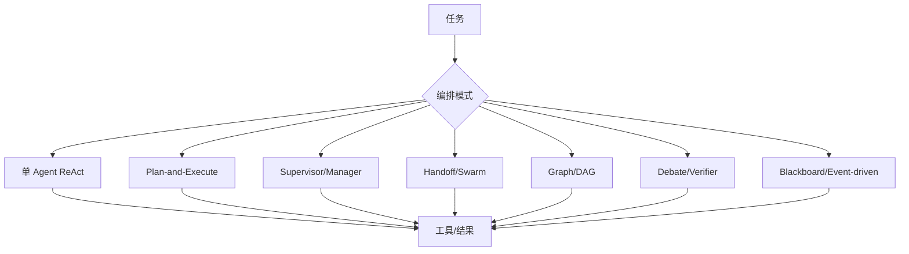

# 27. 前沿 Agent 设计对比：从 ReAct 到可治理的 Multi-Agent

这一章不是“框架排行榜”，而是帮助你在面试中从问题、约束和证据选择架构。所谓前沿，不是 Agent 越自主、角色越多越先进；真正先进的实现通常把状态、权限、评测和失败语义做得更明确。

## 1. 先看模式全景



## 2. 模式比较矩阵

| 模式 | 状态如何传递 | 优点 | 常见失败 | 适合的任务 | DiagOps 映射 |
| --- | --- | --- | --- | --- | --- |
| ReAct | 对话历史 + 工具结果 | 最小实现、探索性强 | 循环、上下文膨胀、不可恢复 | 简单查询/原型 | legacy/教育版，不是 V11 主拓扑 |
| Plan-and-Execute | 先计划，后执行 | 预算和任务可预估 | 计划过时、执行偏离 | 信息缺口明确的调查 | Lead planning → Investigator |
| Supervisor/Manager | 主管把子 Agent 当工具或任务 | 集中协调、易加角色 | 主管成为瓶颈、隐式上下文 | 多专家协作 | V11 的角色思想；状态由 Runtime 而非隐式会话协调 |
| Handoff/Swarm | 当前 Agent 把会话交给下一个 | 灵活、自然对话 | 权限漂移、责任不清、难 replay | 客服/开放式工作流 | 明确未采用为 V11 authority path |
| Graph/DAG | 节点/边和状态显式持久化 | 可恢复、分支/重试清楚 | 图复杂、状态 schema 重 | 长任务、合规流程 | V11 更准确是版本化线性 phase profile + 有界并行 fan-out，可借鉴 graph 思想 |
| Debate/Verifier | 多个候选互相质疑 | 发现反证、降低单点偏差 | 同源模型相关错误、成本高 | 高风险判断 | Investigator → Critic 七项 checks |
| Map-Reduce/MoA | 并行生成，再聚合 | 高吞吐、多视角 | 聚合器幻觉、token 成本 | 批量文档/多案例 | Round 1 并行 + deterministic admission；不做投票 |
| Blackboard | Agent 把结构化事实写共享黑板 | 异步协作、可观察 | 竞态、污染、写权限难控 | 复杂调查/规划 | Evidence ledger + findings 接近此模式 |
| Event-driven | 事件触发下一步 | 解耦、可扩展 | 事件乱序、重复消费 | 运营自动化 | RuntimeEvent/Writer/SSE 基础 |
| Speculative parallel | 并行尝试多个计划/模型 | 降低尾延迟 | 预算倍增、取消浪费 | 延迟敏感且成本可控 | 当前未采用；Round 1 是有意分解的独立调查，不是试探性多计划竞速 |
| Reflection/self-critique | 同一 Agent 自审 | 单模型即可实现 | 自我确认偏差、上下文更长 | 低风险文本质量 | V11 用独立 Critic，避免同会话自审 |

## 3. OpenAI Agents SDK 的两种多 Agent 组合

官方 SDK 文档把多 Agent 组合常分为：

- **Agents as tools / manager**：主管 Agent 保持对话和最终责任，把专家 Agent 作为工具调用；适合主管需要综合所有结果的场景。
- **Handoffs**：当前 Agent 将会话控制权转交给专家；适合后续对话应由专家直接负责的场景。

参考 [Multi-agent system design patterns](https://openai.github.io/openai-agents-python/agents/) 和 [Handoffs](https://openai.github.io/openai-agents-python/handoffs/)。

DiagOps 没有把这两种隐式会话机制直接当作 V11 状态机：Lead 的任务意图先由服务端生成 Task 并落库，Investigator 的证据先提交 ledger，Critic 再读取结构化引用。这样模型交接不会成为恢复所必需的隐藏状态。

## 4. 当前开源/协议生态怎样看

截至 2026-08-30，可关注的实现方向：

| 生态 | 核心抽象 | 适合借鉴的点 | 引入 DiagOps 的注意事项 |
| --- | --- | --- | --- |
| OpenAI Agents SDK | Agent、FunctionTool、handoff、sessions、tracing、guardrails | 轻量模型/工具接口和生命周期 | 不替代本地 durable contract；版本需冻结 |
| LangGraph | 有状态 graph、checkpoint、interrupt、memory | 长任务可恢复、人工在环 | 与现有 Runtime 会形成双状态机，需证明迁移收益 |
| Microsoft Agent Framework | 多 Agent、MCP/A2A、企业治理方向 | 跨 runtime 互操作和企业部署 | 不能因框架宣传跳过 read-only/评测边界 |
| AutoGen | 对话式多 Agent（当前仓库已标 maintenance mode） | 历史多 Agent 实验 | 新项目应评估其继任生态，不把旧 API 当前沿 |
| CrewAI | Crews（自主协作）与 Flows（事件编排） | 高层角色协作 + 流程控制 | 需要核对许可、状态持久化和安全边界 |
| MCP | Host/Client/Server 的工具/资源协议 | 标准化工具发现和互操作 | 工具描述注入、权限、版本、审计和 egress 必须自管 |
| A2A 等 Agent 间协议 | Agent card、任务/消息互操作 | 跨组织/跨 runtime 协作 | 远程 Agent 是不可信服务，需身份、租约和数据最小化 |

这些生态不断变化；面试时说清“借鉴了哪个抽象、为何没有直接引入”比罗列框架名更有价值。官方入口可从 [OpenAI Agents SDK](https://github.com/openai/openai-agents-python)、[LangGraph](https://github.com/langchain-ai/langgraph)、[Microsoft Agent Framework](https://github.com/microsoft/agent-framework)、[CrewAI](https://github.com/crewAIInc/crewAI) 和 [MCP specification](https://modelcontextprotocol.io/specification/latest) 查证。

## 5. 为什么 V11 选择“受限图 + 证据黑板 + 独立 Critic”

V11 的实际拓扑可抽象成：

```text
INTAKE
  → 初始 Provider Evidence
  → Lead planning（1~3 个信息缺口）
  → Round 1 Investigator（最多 3 路隔离并行）
  → Candidate admission
  → Critic（七项因果检查）
  → 可选 Round 2（仅 needs_evidence，最多一批）
  → Critic reconciliation
  → authority projection
  → deterministic validation/report
```

它可类比三种前沿思想：

1. **Graph/DAG**：版本化线性阶段、有限分支、Checkpoint 和恢复点显式持久化；
2. **Blackboard**：Evidence/Finding/Candidate 是服务端拥有、有 owner 的结构化事实；Round 1 Investigator 不共享彼此新 Finding，只在后续 Critic 阶段收敛；
3. **Verifier/debate**：Critic 专门找时间、拓扑、机制、反证和替代解释漏洞。

它刻意不采用：

- 多数投票（同模型错误不独立）；
- 自由 handoff（隐藏状态和权限漂移）；
- 无限 reflection（预算/终止不可控）；
- Critic 自由工具（调查者和裁判职责混合）；
- deterministic RCA 偷换 Agent authority（规则不能发明根因）。

## 6. 选择模式的决策树

```text
任务是否高风险/需审计？
 ├─ 否：单 Agent ReAct 或 manager-as-tools 可先做原型
 └─ 是：状态是否跨进程/长时间？
       ├─ 否：受限 plan-execute + 结构化 verifier
       └─ 是：显式 graph/checkpoint + 人工中断

是否需要跨组织 Agent 互操作？
 ├─ 否：内部 ToolSpec/Provider 契约更简单
 └─ 是：评估 MCP/A2A，并为远程能力单独做 trust boundary

是否需要多视角而非更多 token？
 ├─ 是：隔离并行 + 独立 Critic/不同模型
 └─ 否：先优化 context/tool，不要盲目增加 Agent 数
```

## 7. 教育版受限图实现

```python
GRAPH = {
    "lead": ["investigator_1", "investigator_2", "investigator_3"],
    "investigator_1": ["critic"],
    "investigator_2": ["critic"],
    "investigator_3": ["critic"],
    "critic": ["round2", "authority"],
    "round2": ["reconcile"],
    "reconcile": ["authority"],
    "authority": ["validate"],
}

async def execute(node, state):
    state.check_contract()
    result = await NODE_HANDLERS[node](state)
    await state.commit_checkpoint(node, result)
    return next_nodes(node, result)  # 只能来自预声明边
```

真实 V11 用 `RuntimePhase`/`PhaseProfile` 的线性顺序、有限 Investigator fan-out、Store CAS、lease 和 `PhaseCommit` 实现更严格的版本；教育版没有处理并发、replay、失败收口和数据库事务，不能直接用于生产。

## 8. 多 Agent 的“前沿”难题

### 8.1 相关错误而非独立错误

三个 Agent 共享同一模型、同一误导 Evidence 或同一 prompt 时，票数不是统计独立样本。真正要增加多样性，可以考虑不同模型、不同检索视图、不同任务分解或 adversarial verifier，但每种多样性都增加成本和合同复杂度。

### 8.2 状态与上下文分离

把整个对话转发给下一个 Agent 看似方便，却会把权限、隐私和错误一起传播。前沿实现越来越倾向 typed state/event/blackboard：只转发必要事实，保留来源和版本。

### 8.3 终止与预算

开放式 swarm 需要 global deadline、节点/边预算、重复检测、取消传播和 backpressure。没有这些，Agent 数量只是成本放大器。

### 8.4 可评测性

必须把拓扑、模型、工具、prompt、memory 和随机性冻结，否则无法回答“架构改进还是额外预算带来的提升”。V11 的 Single/Multi/equal-token 设计正是为此服务。

### 8.5 从近期生产经验提炼的准则

近年的公开实现给出的结论并不是“所有任务都该多 Agent”：

- Anthropic 在 [Building effective AI agents](https://www.anthropic.com/engineering/building-effective-agents) 中建议先从最简单可用方案开始；工作流适合定义明确、需要一致性的任务，Agent 适合需要模型驱动决策的开放任务。框架有助于起步，但额外抽象会遮蔽 prompt/response，增加调试难度。
- Anthropic 的 [multi-agent research system](https://www.anthropic.com/engineering/multi-agent-research-system) 使用 Lead-orchestrator + 并行 subagent，适用于可并行检索、信息超过单窗口、工具复杂且任务价值足够高的研究问题。文章报告其数据中普通 Agent 约用聊天交互的 4 倍 token、Multi-Agent 约用 15 倍；这不是通用性能定律，但很好地说明为什么必须做成本/价值评测。
- Anthropic 的 [Effective context engineering](https://www.anthropic.com/engineering/effective-context-engineering-for-ai-agents) 提醒：subagent 可以用干净 context 深入探索，再回传 1,000–2,000 token 的压缩结果给 Lead；这降低了主 Agent 的注意力压力，但回传摘要必须保留来源和不确定性，不能成为无证据结论。
- OpenAI 的 [Agent orchestration guide](https://developers.openai.com/api/docs/guides/agents/orchestration) 建议当 manager 需要对最终答案负责且专家任务有界时，优先 agents-as-tools；只有当职责/所有权真正转移时才 handoff，并且先从单 Agent 开始，只有在能力、策略、prompt 清晰度或 trace 可读性实质改善时再加 specialist。

对 DiagOps 的直接映射是：事故调查跨日志、指标、Trace 和依赖，存在有限且可并行的信息缺口，所以最多三个隔离 Investigator 有合理动机；但它们共享 Run budget、必须把结果落为 Evidence/Finding，而不是把 15 倍 token 成本伪装成“智能提升”。V11 的小规模受限并行、Compact context、Critic、SS15 equal-token 对照，正是将这些公开经验转成可审计合同，而不是复制一个开放式 research swarm。

## 9. 现状标签

**Implemented**：版本化线性 V11 phase profile、最多三路隔离 Investigator fan-out、服务端 Evidence ledger、独立 Critic/verifier、一次补证、durable checkpoint/event/lease、authority projection。

**Partial**：使用 OpenAI Agents SDK 的 Agent/FunctionTool 运行接口；旧 `AgentsRcaRuntime` 仍为 legacy 兼容路径。前沿模式的比较和教育版伪码不代表项目引入了对应框架。

**Not implemented**：自由 handoff/swarm、MCP/A2A 远程 Agent、跨模型 MoA/投票、动态 graph 生成、跨节点事件总线和自动 agent marketplace。

## 10. 面试回答模板

> 我会把“Multi-Agent”拆成编排模式、状态传递和验证模式来选。DiagOps V11 不是三个模型自由聊天，而是一个受限的 durable graph：Lead 规划信息缺口，最多三个 Investigator 隔离并行写入 Evidence blackboard，Critic 用七项检查验证候选，最多一轮 ownership 明确的补证，最后由 authority projection 发布。它借鉴 graph、blackboard 和 verifier/debate，拒绝多数投票、无限 reflection 和隐式 handoff，因为这些会带来相关错误、隐藏状态、预算失控和不可 replay。OpenAI Agents SDK/LangGraph/MCP/A2A 都有可借鉴的抽象，但当前依赖和安全边界没有引入后者；若未来采用，必须先证明状态、权限、版本、成本和评测收益。

## 11. 学习核对清单

- [ ] 能比较 ReAct、Plan-and-Execute、Manager、Handoff、Graph、Debate、Blackboard。
- [ ] 能解释 Agents-as-tools 与 Handoff 的责任/状态差异。
- [ ] 能把 V11 映射到 graph、blackboard、verifier 三种模式。
- [ ] 能说出为什么票数不等于独立证据。
- [ ] 能画出一个带 checkpoint、budget、cancel 和 owner 的多 Agent 图。
- [ ] 能说明引入框架/MCP/A2A 前需要哪些评测和安全门。
