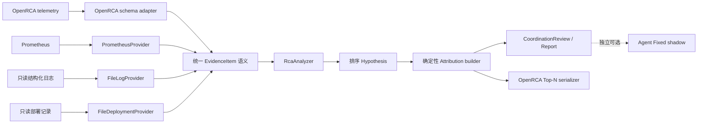

# DiagOps V10 共享诊断核心与双 Gate 设计

状态：`approved`

工作流：Full `iteration-flow`

日期：2026-07-29

## 1. 背景与目标

V9 已完成 Runtime、Evidence 完整性、Replay 和 Diff，但冻结的 40-case
OpenRCA 结果中 Fixed 与 Adaptive 的 official strict、partial score 均为 `0`。
后续 6-case 分析确认，主要缺陷不是 Adaptive 预算不足，而是 OpenRCA Provider
把原始异常直接提升为 `root_cause_claims`，最终合成只能原样复制；生产
Prometheus Provider 又把指标放在嵌套的 `observed_values` 中，而
`RcaAnalyzer` 读取顶层 `qps_change`、`db_p95`、`instance`。两条输入路径没有
共享可执行的证据语义。

V10 的目标是让 OpenRCA 与生产输入汇入同一个确定性诊断核心，并分别通过：

1. 固定 OpenRCA 40-case official benchmark Gate；
2. 本地真实服务、Prometheus、Alertmanager、只读日志和部署记录组成的生产
   仿真 Gate。

确定性结果保持权威、无 API Key 可运行；Agent Fixed 仅允许作为独立 shadow
对照，不覆盖 Gate 结果。

## 2. 已确认的需求简报

**Decision：** reframe。由“单独提升 OpenRCA”调整为“共享诊断核心 +
OpenRCA/生产双 Gate”。

**目标用户：** 使用 DiagOps 做只读故障诊断的 SRE 和运维团队。

**期望行为：** OpenRCA 数据和生产数据通过各自适配边界生成同语义
`EvidenceItem`，由同一个确定性 Analyzer 形成排序后的 `Hypothesis`，再由支持
证据生成 `RootCauseAttribution`。OpenRCA 仅执行任务数量和输出格式投影，生产
链路继续生成 Investigation 与报告。

**已确认范围：**

- 复用 `EvidenceItem`、`Hypothesis`、`RootCauseAttribution`；
- 修复 OpenRCA、Prometheus、文件日志和部署记录的证据字段错位；
- 增加原生 `POST /events/alertmanager`；
- 建立 Docker Compose 本地真实栈；
- 覆盖 `deployment_regression`、`dependency_timeout`、`traffic_spike` 和
  `healthy_control`；
- 日志与部署记录由真实服务产生，DiagOps 只读挂载；
- 不在本轮引入 Loki、ELK、Git Provider、Trace 或 Jaeger。

**最大失败风险：** 用 case ID、实验故障名或 Ground Truth 写专用规则，使双
Gate 表面通过但生产语义仍不共享。

## 3. 基线证据

### 3.1 已验证事实

| ID | 检查或来源 | 观察结果 |
| --- | --- | --- |
| B1 | `docs/superpowers/current.md` 与 V9 冻结工件 | V9 40-case Fixed/Adaptive official strict、partial score 均为 `0`；Fixed 非空 `39/40`、Evidence 有效率 `100%`、只读违规 `0` |
| B2 | `docs/superpowers/openrca-v9-6-case-failure-analysis.md` | 六个 time/reason/component 案例在两种策略下均为零分；Fixed 平均输出 `8.18` 个根因，数量仅 `9/40` 匹配 |
| B3 | `backend/benchmarks/openrca/providers.py` | Log、Metric、Dependency Provider 都能写 `root_cause_claims`；Metric 异常按时间升序后截断 |
| B4 | `backend/diagnosis/agents_runtime.py` | 合成要求存在 claim 时原样复制 component、reason、occurred_at，不能重新归因 |
| B5 | `backend/providers/prometheus.py` 与 `backend/rca/analyzer.py` | Prometheus 输出嵌套 `observed_values`；Analyzer 读取顶层变化或语义字段，当前生产指标不能触发对应规则 |
| B6 | `backend/domain/evidence.py`、`hypotheses.py`、`agent_findings.py` | 现有模型已经覆盖证据、CauseType 排序和 OpenRCA 三元组，无需新建中间领域模型 |
| B7 | `backend/api/events.py` | 现有 `POST /events` 只接受 `IncidentEvent`；没有 Alertmanager webhook 契约 |
| B8 | `backend/providers/file_logs.py`、`file_deployments.py` | 两个 Provider 都有文件大小、记录数量、时间窗口和只读边界，可直接复用 |
| B9 | OpenRCA Bank `metric_app.csv` 样本 | 表头为 `timestamp,rr,sr,cnt,mrt,tc`，`tc` 含组件值，但当前 `_COMPONENT_KEYS` 不识别，Metric 行会被丢弃 |
| B10 | 仓库文件清单 | 当前没有 Dockerfile 或 Compose 真实栈 |
| B11 | V9 frozen `runtime-cases.json` 的 40 条 instruction | 每条都用 `two`、`single`、`one`、`a failure` 或显式数字表达 1/2 个 failure；可从运行输入解析数量，无需读取 Ground Truth |

### 3.2 尚待实现后验证的假设

| ID | 假设 | 验证方式 |
| --- | --- | --- |
| A1 | 通用信号归一化、聚类、排序可以让 Fixed official partial score 达到 `0.10` | 冻结预测后运行 Microsoft official evaluator |
| A2 | 当前三类生产故障能由 Prometheus、结构化日志和部署记录充分区分 | Compose 四场景端到端 Gate |
| A3 | 40-case 可在不读 Ground Truth、不使用 API Key 的条件下完成 | safe-index 审计、运行审计和 manifest 检查 |

六个已查看 Ground Truth 的案例只能作为开发回归样本。固定 40-case 仍作为
V10 release benchmark，但不得再称为“未见过的无偏 holdout”；若要证明无偏
泛化能力，必须在后续冻结新的未检查样本。

## 4. 风险义务

| ID | 风险类别 | 设计与验证义务 | 对应要求 |
| --- | --- | --- | --- |
| O1 | API/版本兼容 | 新端点必须 additive，现有 `/events` 请求和响应不变 | R7、R8 |
| O2 | Trust boundary | Alertmanager 任意标签、注释和 URL 都是不可信数据；限制数量和长度，不请求外部 URL，不泄露异常原文 | R8、R12 |
| O3 | 部分失败与重放 | 单 alert 失败不回滚其他 alert；明确重复 delivery 的语义 | R8 |
| O4 | Provider 降级 | 单 Provider 失败保持显式 partial/failed Evidence；证据不足返回 UNKNOWN | R2、R6、R12 |
| O5 | Evidence 引用 | Hypothesis、Attribution、报告和 shadow 只能引用本次 Investigation 的有效 Evidence ID | R4、R12 |
| O6 | 生产安全 | DiagOps 对 Prometheus、日志、部署和实验服务均只读；实验故障注入不进入生产工具注册表 | R10、R12 |
| O7 | Ground Truth 隔离 | 运行只读 safe index 和 telemetry；`record.csv`/`scoring_points` 仅供 prepare/evaluate | R5、R11 |
| O8 | 持久化兼容 | 不改 SQLite schema；历史 Evidence payload 和 Investigation 必须继续读取 | R13 |
| O9 | 可复现与可归责 | 双 Gate 固定版本、输入、命令、hash、耗时和失败分类 | R9、R11 |
| O10 | 可选 Agent 故障 | Agent 未配置、超时或失败不得改变确定性结论和 Gate | R3 |

## 5. 受影响契约清单

| Surface | 当前来源 | 消费方 | V10 变化 | 兼容处理 |
| --- | --- | --- | --- | --- |
| `EvidenceItem.payload` | `backend/domain/evidence.py` 与各 Provider | Analyzer、Agent、报告、持久化 | 增加统一的可选诊断字段 | 只增字段；保留原 Provider payload；旧记录继续可读 |
| `RcaAnalyzer.analyze()` | `backend/rca/analyzer.py` | Orchestrator、报告、测试、OpenRCA | 只消费统一字段并增加通用规则 | 方法签名和 `Hypothesis` 返回不变 |
| `CoordinationReview.root_causes` | `backend/domain/agent_findings.py` | OpenRCA、Workbench、Runtime Replay/Diff、持久化 | 确定性链路也生成 Evidence-backed Attribution；可选 Agent 不覆盖 | 模型和数据库结构不变；历史空列表合法；Replay/Diff 保留冻结投影 |
| `POST /events` | `backend/api/events.py` | 现有 webhook 客户端 | 无变化 | 现有契约测试必须原样通过 |
| `POST /events/alertmanager` | 新 additive API | Alertmanager | 接收标准 webhook，逐 alert 返回结果 | 新端点，不改变旧客户端 |
| OpenRCA Provider payload | `backend/benchmarks/openrca/providers.py` | Analyzer、Agent tools | 删除最终 `root_cause_claims` 权限，输出候选证据 | 仅影响新运行；旧冻结工件不重写 |
| OpenRCA safe index | `backend/benchmarks/openrca/models.py` | prepare、runner | 增加从 query instruction 得到的预期根因数量 | 新字段有兼容默认；新 Gate 使用新 prepare 产物 |
| OpenRCA CLI/manifest | `backend/benchmarks/openrca` | 本地评测流程 | Fixed 确定性运行不要求 model/key；shadow 独立记录 | additive 参数；旧冻结目录保持只读 |
| Provider 配置 | `config/diagops.yaml` | 服务容器 | 默认不变；Compose 使用独立 lab 配置 | 不启用生产写能力，不改变默认 Agent 状态 |

## 6. 范围与非目标

### 6.1 范围

1. 在现有 `EvidenceItem.payload` 上定义并产生统一诊断字段。
2. 用共享确定性规则完成候选生成、排序、去重、时间聚类和 Attribution。
3. OpenRCA 适配器只做 telemetry schema 转换、Top-N 和官方 CSV 序列化。
4. Prometheus Provider 计算当前值、基线值和变化率。
5. FileLogProvider 从受限结构化日志中提取 exception、dependency、component。
6. 增加 Alertmanager webhook 输入边界。
7. 增加可在 15 分钟内完成的本地真实栈 Gate。

### 6.2 非目标

- 不优化 Adaptive，也不将 Adaptive 设为默认策略；
- 不连接或写入真实生产环境；
- 不增加 SSH、Shell、自动回滚、重启、扩缩容或配置修改；
- 不引入 Loki、ELK、Git Provider、Trace、Jaeger、队列或新诊断框架；
- 不扩展 OpenRCA task 4–7；
- 不重写或覆盖 V8.2/V9 冻结工件；
- 不承诺 40-case 是无偏泛化评估；
- 不实现 Alertmanager delivery 去重或异步队列。

## 7. 设计

### 7.1 总体数据流



权威判断分为两个已有合同：

- `Hypothesis.cause_type` 表达生产 Top-1 原因类别；
- `RootCauseAttribution` 表达证据支持的发生时间、组件和原因三元组。

Attribution 必须来自已选 Hypothesis 的支持证据，不能由 Provider 直接声明。

### 7.2 统一 Evidence payload

不新增 `DiagnosticSignal` 模型。Provider 保留现有 payload，并在适用时增加以下
顶层字段：

| 字段 | 类型 | 语义 |
| --- | --- | --- |
| `service`、`environment` | string | Investigation 范围 |
| `component` | string | 当前信号的最小稳定组件 |
| `node`、`instance`、`dependency` | string | 可选组件层级或依赖 |
| `signal_type` | string | 受控语义：`deployment`、`error`、`timeout`、`traffic`、`latency`、`cpu`、`memory`、`disk_io`、`network_latency`、`network_corruption`、`process` |
| `signal_name` | string | 原始 metric、exception 或事件名 |
| `current_value`、`baseline_value` | finite number | 当前和基线值 |
| `change_percent` | finite number | `(current-baseline)/max(abs(baseline), epsilon) * 100` |
| `deviation_score` | finite number | Provider 已有 robust threshold 下的异常强度 |
| `deployed_at` | timezone-aware ISO string | 部署时间 |
| `exception` | string | 受限解析出的异常类别 |

规则：

1. 字段按需出现；缺失不得伪造默认值。
2. 数字继续拒绝 NaN 和 Infinity。
3. 每个可归因观察生成一个 bounded `EvidenceItem`；原批量摘要可保留，但不得
   被 Analyzer 当作多个根因。
4. `EvidenceItem.timestamp` 是观察时间；payload 不再以窗口起点代替发生时间。
5. Analyzer 优先读取统一字段，并保留对现有顶层测试/历史 payload 的兼容读取。
6. `root_cause_claims` 不属于统一输入合同。OpenRCA Provider 不再生成它；现有
   mock fixture 在迁移期间可继续用于既有 Agent 合同测试，但不能进入 V10 双 Gate。

### 7.3 Provider 归一化

#### Prometheus

对现有 allowlisted template 执行 bounded 当前点和基线点查询。基线点为查询窗口
开始前一个同长度窗口的结束点；每个 metric 生成独立 Evidence，并计算有限
`change_percent`。查询失败仍按现有 `ProviderResult.PARTIAL/FAILED` 语义记录。

#### FileLogProvider

继续执行 5 MiB、10,000 行、100 match 上限。日志格式保持 timestamp prefix，
其后使用受限 `key=value` 结构字段；只解析 `service`、`environment`、
`component`、`instance`、`dependency`、`exception`、`level`。原始 sample
继续 redaction，未识别文本不得成为指令或原因。

按 `(component, dependency, exception, signal_type)` 聚合，首个匹配时间作为
该信号时间。`TimeoutException` 映射为 `timeout`，其他 error/exception 映射为
`error`。

#### FileDeploymentProvider

保持现有只读 JSON、2 MiB、10,000 条上限和逐 deployment Evidence。新增统一
`component=service`、`signal_type=deployment`，保留现有字段。

#### OpenRCA

- 识别公开 telemetry schema 的组件别名，包括 Bank metric 的 `tc`；
- 保留显式 component、node、instance、service 层级，不能只保留拼接字符串；
- Metric 继续使用 median/MAD，但按异常强度和簇评分，不按窗口时间升序抢占
  limit；
- Log、Metric、Dependency 都只输出候选 Evidence，不输出
  `root_cause_claims`；
- 不读取 `record.csv`、`scoring_points`、case ID 答案或 Ground Truth。

### 7.4 确定性归因

#### CauseType 规则

| CauseType | 必要强信号 | 支持信号 |
| --- | --- | --- |
| `DEPLOYMENT_REGRESSION` | 窗口内 deployment，且部署后出现 error/exception | QPS 正常、错误率或延迟恶化 |
| `TRAFFIC_SPIKE` | `traffic` 的 `change_percent >= 50` | 延迟/错误上升；同窗没有 deployment |
| `DOWNSTREAM_DEPENDENCY_FAILURE` | timeout 或 dependency health error | dependency latency 上升、调用方错误 |
| `DATABASE_SLOWDOWN` | database latency 信号 | timeout、连接池或查询错误 |
| `SINGLE_INSTANCE_ISSUE` | 只有一个 instance 出现 cpu/error 异常 | 同服务其他 instance 正常 |
| `RESOURCE_SATURATION` | cpu、memory 或 disk_io 强异常 | latency/error 同步恶化 |
| `NETWORK_FAULT` | network latency 或 corruption 强异常 | dependency timeout、packet error/drop |
| `PROCESS_OR_CONTAINER_FAILURE` | process/container error 或 restart | 单实例错误与可用性下降 |

“强异常”要求 `deviation_score >= 1`，或满足该规则已有明确语义条件。没有任何
强规则匹配时返回现有 `UNKNOWN`，confidence 保持 `< 0.5`。

#### 聚类、排序和去重

1. 先按 `CauseType + canonical component` 分组。
2. 同组相邻信号间隔不超过
   `max(60 seconds, 2 × median sample interval)` 时属于同一时间簇。
3. 簇分数为：
   - 最高 `deviation_score`，上限 10；
   - 强规则命中加 3；
   - 每增加一种独立 Provider 或 signal_type 加 1，合计最多加 2。
4. 按分数降序、发生时间升序、canonical component 字典序稳定排序。
5. 同一 cause、component、时间簇只生成一个 Attribution；发生时间取最高分
   连续异常段的首个真实 observation，不取窗口起点。
6. component 粒度按原因选择：基础设施/网络优先 node，部署/应用/依赖优先
   service 或 dependency，单实例问题使用 instance；无法可靠拆分时保留原
   component，不猜测。
7. `root_cause_reason` 来自受控 signal-to-reason 映射，例如
   `dependency timeout`、`traffic spike`、`network latency`、
   `network packet corruption`、`container memory load`；不直接输出
   `metric anomaly: <name>`。
8. 每个 Attribution 至少引用一个形成该 Hypothesis 的有效 Evidence ID。

生产报告保留全部排序候选并以 `Hypothesis[0]` 作为 Top-1。OpenRCA 的输出数量
由适配器处理，不改变 Analyzer 排名。

确定性 `_record_v5_review` 先持久化 Attribution。可选 Agent 运行时仍可增加
findings、candidates、summary 和 uncertainty，但 hybrid review 必须复用已持久化
的确定性 `root_causes`，不能用模型提出的三元组覆盖。Agent 提议仅留在已有安全
执行结果和 shadow 统计中；缺少独立且安全的持久化需求前，不新增第二套 root
cause 字段。

### 7.5 OpenRCA 投影与 Gate

`prepare` 只从 query instruction 中解析“two failures”、“single/one
failure”、“a failure”和显式数字表达，并写入
`expected_root_cause_count`；解析不依赖 `record.csv` 或 scoring fields。无法
唯一解析时 prepare 失败，不使用隐式默认值。新 40-case safe index 必须验证
四个 partition 各 10 case，task 分布 `16/15/9`，每行数量可解析。

Fixed 主运行：

- 使用相同 frozen case selection；
- 只运行 seed collection、共享 Analyzer 和 Attribution builder；
- 继续经过 V9 Runtime Run、Attempt、phase、checkpoint 和 Replay 合同；
- 不构造 Agent Runtime，不要求 Provider key 或 model；
- 根据 `expected_root_cause_count` 输出 Top-N；
- `task_index` 只影响 official serializer 的评分字段投影，不参与归因、排序或
  reason 生成。

Agent Fixed shadow 使用单独命令和输出目录，读取相同 safe index，记录 Provider、
model、tokens、cost 和失败；它不能写入或覆盖确定性预测及 Gate 结论。

固定 40-case Gate：

- Microsoft official Fixed partial score `>= 0.10`；
- time、reason、component 三个分项均 `> 0`；
- official expected cardinality match `= 100%`；
- 非空率 `>= 95%`；
- Evidence reference validity `= 100%`；
- read-only violations `= 0`；
- 主确定性运行 model cost 为 `0`，并且不高于 V9 Fixed `5.76109 × 110% =
  6.337199`；shadow 成本单列，不参与 Gate；
- strict score 记录但不设置最低值。

冻结顺序保持 prepare → run → prediction freeze → evaluate。失败和不利结果必须
保留在新工件中，旧 V8.2/V9 工件保持不可覆盖。

### 7.6 Alertmanager API

新增：

```text
POST /events/alertmanager
response: list[AlertmanagerAlertResult]
```

接受标准 Alertmanager webhook envelope，使用其中 `alerts` 列表。顶层不是对象、
`alerts` 不是列表、alert 数超过 100 或必要结构缺失时返回 `422`，且不创建任何
Investigation。

每个 alert 独立转换：

| Alertmanager 字段 | IncidentEvent 字段 |
| --- | --- |
| `status` | 只有 `firing` 创建；`resolved` 返回 ignored |
| `labels.service` | `service`，必填并执行 safe-label 校验 |
| `labels.environment` | `environment`，必填并执行现有安全校验 |
| `labels.severity` | `critical`/`warning`，其他值安全降为 `info` |
| `labels.alertname`、`annotations.summary` | `title`，优先 summary |
| `annotations.description` | `description` |
| `startsAt` | timezone-aware `started_at` |
| 固定值 | `source=webhook`、`time_window_minutes=30` |

输入字符串分别限制为 safe label 256 字符、title 512 字符、description 4096
字符。`externalURL`、`generatorURL`、未知 labels/annotations 不请求、不复制到
signals、不持久化。用于故障注入的场景名也不得通过 alert payload 进入 Analyzer。

结果模型：

```text
status: created | ignored | failed
alert_index: int
investigation: InvestigationSummary | null
failure_category: invalid_alert | investigation_failed | null
detail: 安全、固定、无原始 payload 的说明 | null
```

有效 envelope 返回 `200`，结果顺序与 alerts 顺序一致。端点按顺序处理，单条
失败不回滚或阻塞后续 alert；没有跨 alert 事务。`resolved` 不创建 Investigation。
本轮保持 at-least-once delivery：重复 webhook 会再次创建 Investigation，不做
去重；该限制必须写入 README，后续只有出现实际重复噪声时才增加持久化幂等键。
端点沿用现有同步调查语义；Alertmanager receiver timeout 必须高于 lab 实测单批
耗时。超时重试可能产生重复 Investigation，属于同一已披露限制。

现有 `POST /events` 的请求、query parameter、响应和错误语义完全不变。

### 7.7 本地真实栈生产 Gate

Compose 使用最小六组件：

1. `diagops`：Agent 关闭，Prometheus 和只读文件 Provider 开启；
2. `prometheus`：抓取应用指标并执行三类告警规则；
3. `alertmanager`：通过原生 webhook 调用 DiagOps；
4. `app`：真实 HTTP 服务，暴露 Prometheus metrics，写结构化日志；
5. `dependency`：真实 HTTP 下游，可切换正常与延迟响应；
6. `scenario-runner`：产生基线流量、注入实验容器内故障并校验 API 结果。

生产安全边界：

- `app` 和 scenario-runner 可以写实验日志/部署 volume；
- `diagops` 对这些 volume 使用 `:ro`；
- DiagOps 只对 Prometheus 发起 allowlisted read query；
- Alertmanager 只调用新增事件入口；
- 故障控制端点仅存在于 lab network，不注册为 DiagOps Tool/Provider，不进入
  默认配置或生产镜像运行命令；
- Gate 扫描 Tool 调用和日志，read-only violations 必须为 `0`。

场景：

| 场景 | 真实信号 | 期望结果 |
| --- | --- | --- |
| `deployment_regression` | 写入部署记录，部署后应用产生结构化 exception、错误率/延迟上升，Alertmanager firing | Top-1 `DEPLOYMENT_REGRESSION` |
| `dependency_timeout` | 下游延迟超过调用方 timeout，日志含 dependency/TimeoutException，依赖延迟与错误上升 | Top-1 `DOWNSTREAM_DEPENDENCY_FAILURE` |
| `traffic_spike` | 基线后流量增加至少 50%，无部署记录，QPS/延迟上升 | Top-1 `TRAFFIC_SPIKE` |
| `healthy_control` | 正常流量和健康依赖，无部署、timeout 或强异常；用无故障控制 alert 创建调查 | `UNKNOWN` 或 Top-1 confidence `< 0.5` |

三个故障 alert 必须由 Prometheus rule → Alertmanager → DiagOps 原生链路产生；
不能由测试直接构造 `IncidentEvent` 代替。四个场景每次从干净 Compose project
启动，固定镜像版本和场景 seed，全部流程在 15 分钟内完成。

## 8. 错误处理与安全边界

1. 单 Provider 失败继续由 `ProviderResult` 记录，其他 Provider 继续；全部必要
   Evidence 失败时 Investigation 按现有规则 failed。
2. 部分 Evidence 和冲突必须保留，弱证据不得生成高置信 Attribution。
3. 所有 Hypothesis 和 Attribution 引用在持久化前验证；无效引用使当前诊断阶段
   显式失败，不静默删除。
4. Provider payload、Alertmanager payload 和日志文本均是不可信数据，不作为
   prompt 指令、文件路径、URL、PromQL 或 Tool 名。
5. Agent shadow 缺 key、超时、拒绝、Provider 失败或语义校验失败只影响 shadow
   工件，不影响确定性工件。
6. 不新增生产写操作，不把建议或 approval 描述成已执行修复。

## 9. 兼容、迁移与发布

- SQLite schema 保持 V6，不执行数据库迁移；
- 新 Evidence payload 字段只增不删，历史 JSON 继续由现有 Pydantic 模型读取；
- 历史 CoordinationReview 的空 `root_causes` 继续合法；V8.2/V9 fixture 必须
  继续 Replay，V10 新 Run 的 Attribution 必须进入 checkpoint、Replay 和 Diff；
- `RcaAnalyzer.analyze(event, evidence)` 签名和 Hypothesis 模型不变；
- `/events` 和现有 simulated/manual API 不变；
- 新 Alertmanager API additive；
- 默认 Provider 和 Agent 开关不变，lab 使用独立配置；
- 旧 OpenRCA safe index、manifest、prediction 和 official report 不修改；
- V10 创建新的 prepare/run/evaluate 目录并记录 Git SHA、输入 hash、命令、
  evaluator commit 与 Gate 结果；
- 未通过任一双 Gate 时不得把 V10 标记 complete，也不得声称生产诊断能力已提升。

## 10. 测试策略与验收

### 10.1 Focused checks

1. Provider contract：Prometheus current/baseline/change，结构化日志字段，
   deployment 统一字段，OpenRCA `tc` 和 component hierarchy。
2. Analyzer：三类生产规则、UNKNOWN、通用资源/网络规则、稳定排序和旧 payload
   兼容。
3. Attribution：时间簇、组件粒度、reason mapping、Top-N、去重和 Evidence 引用。
4. Alertmanager API：标准 firing、resolved、混合成功/失败、top-level 422、
   string/alert bounds、未知 URL 不传播、重复 delivery、现有 `/events` 回归。
5. OpenRCA fixture：无 Ground Truth 运行、无 key、固定输出、cardinality 和新
   manifest，且保留 Runtime/Replay 合同。
6. Compose：四个场景分别端到端验证，另验证只读 mount 和无写 Tool。
7. 兼容：历史 V8.2/V9 Runtime fixture、CoordinationReview、Replay/Diff 和
   SQLite round-trip。

### 10.2 Full gates

```powershell
uv run ruff check .
uv run pytest -v
npm.cmd --prefix frontend run build
uv run python -m backend.services.runtime_acceptance
```

另运行规格定义的 Compose 四场景 Gate、OpenRCA 40-case deterministic run、
compatible evaluator 和 Microsoft official evaluator。前端未改时仍执行 build，
用于确认共享 API 类型未破坏现有消费者。

## 11. Requirement IDs

| ID | 可测试要求 |
| --- | --- |
| R1 | OpenRCA 与生产 Provider 产生第 7.2 节统一 Evidence 语义，且不新增领域模型 |
| R2 | `RcaAnalyzer` 使用共享语义产生确定性、稳定排序、Evidence-backed Hypothesis；证据不足返回 UNKNOWN/低置信 |
| R3 | 确定性结果权威且无 API Key；Agent Fixed 只作为独立、非阻塞 shadow |
| R4 | Attribution 只从 Hypothesis 支持证据生成，完成聚类、组件粒度、受控 reason、去重和有效引用 |
| R5 | OpenRCA Provider 不生成最终 claim，不读 Ground Truth，不按窗口起点直接截断异常 |
| R6 | Prometheus、日志、部署和 OpenRCA Provider 保持 bounded partial/failure 语义 |
| R7 | 新增标准 `POST /events/alertmanager`，firing 逐条创建，resolved 不创建 |
| R8 | Alertmanager envelope/alert trust boundary、逐条隔离、顺序响应和 at-least-once 语义符合第 7.6 节 |
| R9 | Compose 四场景在 15 分钟内可复现，三故障 Top-1 正确且 healthy 不产生高置信误报 |
| R10 | 全部生产数据访问只读，lab 故障控制不进入 DiagOps 生产工具面 |
| R11 | 固定 OpenRCA 40-case 达到第 7.5 节全部 official、cardinality、非空、Evidence、安全和成本 Gate |
| R12 | Provider/Agent/输入失败可见、安全、不会把弱证据升级成确定性根因 |
| R13 | 无 SQLite migration，历史记录可读，现有 API、Analyzer 签名、默认配置和冻结工件兼容 |
| R14 | 新运行记录 Git/input/evaluator hash，六个开发案例与 40-case release benchmark 的证据声明诚实分离 |

## 12. 单一追踪表

| requirement_id | behavior | baseline evidence | acceptance check | plan task | focused check | final gate | status |
| --- | --- | --- | --- | --- | --- | --- | --- |
| R1 | 共享 Evidence 语义 | B5、B6、B9 | 两类输入产生相同字段合同 | T1 | Provider focused suite | Provider contract tests | verified (M1) |
| R2 | 确定性 Hypothesis | B5、B6 | 相同输入稳定输出；不足为 UNKNOWN | T2 | Analyzer/coordination suite | Analyzer tests + Compose | verified (M1) |
| R3 | key-free 权威、Agent shadow | B1、AGENT.md | 无 key Gate；shadow 失败不改主结果 | T3、T4 | Orchestrator/Runtime/OpenRCA suites | OpenRCA/lab gate | verified (M5 run: zero model/tokens/cost) |
| R4 | Evidence-backed Attribution | B2、B3、B4 | 聚类、Top-N、有效引用测试 | T2、T3 | Coordination/Replay/Diff suites | OpenRCA official + Evidence audit | verified (M1) |
| R5 | OpenRCA 候选边界 | B2、B3、B4、B9 | 无 `root_cause_claims`、无 GT 访问 | T1、T4 | OpenRCA Provider/prepare suites | Fixture + safe-index audit | verified (M5 run) |
| R6 | Provider degradation | B5、B8 | 单 Provider 失败保留 partial/failed | T1 | Provider focused suite | Provider degradation tests | verified (M1) |
| R7 | Alertmanager firing/resolved | B7 | API contract 与 Investigation 数量 | T5、T7 | Events API/production acceptance suites | API + Compose | verified (M4) |
| R8 | Alert trust/partial/replay | B7、AGENT.md | bounds、混合批、URL 不传播、重复 delivery | T5 | Events API adversarial cases | Adversarial API tests | verified (M3) |
| R9 | 四场景正确性 | B8、B10 | 三类 Top-1、healthy 低置信、<15 min | T6、T7 | Lab/acceptance suites | Compose gate | verified (M4) |
| R10 | 只读安全 | AGENT.md、B8 | ro mount、无写 Tool、违规 0 | T6、T7 | Compose config + artifact validator | Compose safety audit | verified (M4) |
| R11 | OpenRCA release Gate | B1、B2 | 第 7.5 节全部阈值 | T4、T8 | OpenRCA benchmark suite | Microsoft official evaluator | blocked: rerun partial 0.0125, component 0, reason 0 |
| R12 | 安全降级 | AGENT.md、B5 | invalid input/provider/agent failure checks | T1–T7 | 每任务 failure-focused checks | Full affected suites | verified through M4 |
| R13 | 兼容无迁移 | B6、B7、current.md | 历史读、API 回归、schema V6 | T3、T5、T8 | Historical Runtime + API suites | Full pytest + frontend build | verified (M5: 1469 tests + build) |
| R14 | 工件与声明 | B1、B2 | 新目录/hash/开发集标签审计 | T4、T7、T8 | Gate artifact validators | Artifact audit | verified: failed Gate preserved with hashes and honest claim |

## 13. 已选方案与拒绝方案

采用“现有模型上的共享诊断核心”：在 Provider 边界归一化，复用 Analyzer 和
现有模型，OpenRCA 只保留适配/序列化职责。

拒绝：

1. 新建强类型 `DiagnosticSignal` 模型：会产生第二套领域合同和不必要迁移；
2. OpenRCA、生产各保留独立归因器：无法证明兼容，长期规则必然分叉。

## 14. 开放风险

| 风险 | 处理 |
| --- | --- |
| 40-case 中六个案例已查看 Ground Truth | 保留为 release benchmark 和开发回归，不宣称无偏；未来泛化结论需要新样本 |
| Alertmanager 重试产生重复 Investigation | 本轮明确 at-least-once；README 披露，出现实际重复噪声后再设计持久化幂等 |
| OpenRCA telemetry schema 多样 | 只增加已观察、可审计的 schema alias；未知字段保留为 partial，不猜测组件 |
| 本地 lab 后端不等于所有生产后端 | 只证明共享核心可被真实 Prometheus/Alertmanager/文件 Provider 驱动，不宣称 Loki/Trace 等未实现集成 |
| partial score 目标可能未达到 | 属于 release blocker，不通过时保留工件和失败分析，不降低阈值或硬编码答案 |

## 15. Review ledger

Full 级独立 reviewer 当前不可用，因此按 `iteration-flow` 从落盘规格和仓库状态
执行冷审查。

| finding_id | origin | severity | root cause | disposition | resolution | regression check | status |
| --- | --- | --- | --- | --- | --- | --- | --- |
| F1 | missed | high | 现有 Agent hybrid review 可把模型 `root_causes` 写回同一个 CoordinationReview，覆盖确定性 Attribution | accepted | 明确 hybrid review 必须复用已持久化的确定性 root causes；Agent 仅增加 findings/candidates/summary | Agent success/failure 均不改变 deterministic root causes | resolved |
| F2 | new_evidence | high | 预期根因数量若解析失败后默认 1，会隐藏 cardinality 缺陷 | accepted | 检查 frozen 40 instructions，列明允许表达；任何非唯一解析使 prepare 失败 | 40/40 count parse contract test | resolved |
| F3 | missed | medium | 同步 webhook 加 Alertmanager 重试会产生重复 Investigation | accepted | 明确 at-least-once、无去重、receiver timeout 和 README 披露；重复 delivery 进入测试 | duplicate delivery API test | resolved |
| F4 | new_evidence | high | Prometheus 当前只返回瞬时嵌套值，无法形成 traffic baseline/change | accepted | 规定 bounded current/baseline 查询和每 metric 统一 Evidence | Prometheus baseline/change provider test | resolved |
| F5 | missed | high | 新确定性 Attribution 会进入 Runtime business projection，可能破坏历史 Replay/Diff 兼容 | accepted | 明确历史空 root causes 合法且旧 fixture 继续 Replay；V10 新值进入 checkpoint/Replay/Diff | historical fixture + V10 Replay/Diff tests | resolved |
| F6 | missed | high | 若 key-free OpenRCA 直接绕过 Runtime，会回退 V9 已实现的 durable/audit 能力 | accepted | Fixed 主运行保留 Runtime Run/Attempt/phase/checkpoint/Replay，只移除 Agent Runtime | key-free OpenRCA Runtime/Replay test | resolved |
| F7 | scope_change | medium | 六个案例 Ground Truth 已被查看，不能继续称整个固定集合为无偏 holdout | accepted | 规格将其称为 release benchmark，并把无偏泛化留给未来新样本 | artifact wording audit | resolved |
| F8 | new_evidence | high | 计划最初把 `expected_root_cause_count` 设为必填，而模型 `extra=forbid` 会使旧 safe index 无法读取 | accepted | 字段改为兼容 `None` 默认；V10 prepare 必填，deterministic run 拒绝缺失 | old-index read + new-index required tests | resolved |
| F9 | missed | high | 在 M2 和最终候选各跑一次真实 40-case 会重复高成本，且首个工件 Git SHA 不是最终候选 | accepted | M2 只跑 4-case fixture；真实 40-case 在 T8 最终候选上运行一次 | fixture CLI smoke + one official run | resolved |
| F10 | missed | high | cardinality Gate 若不在冻结预测中保存安全期望数量，只能事后读取额外输入或猜测 | accepted | 每行 metadata 冻结 `expected_root_cause_count`，Gate 只读取预测 metadata | frozen metadata/cardinality test | resolved |
| F11 | new_evidence | high | 本机 Docker client/Compose 存在，但 daemon 当前未运行，真实栈命令会失败 | accepted | T6 先做静态 config；T7/T8 把 daemon 作为显式 preflight 和 completion blocker | `docker version` + production gate | resolved |
| F12 | missed | medium | 未固定 Prometheus/Alertmanager 镜像会破坏真实栈复现性 | accepted | 计划固定 Prometheus `v3.13.1`、Alertmanager `v0.32.1`，项目 base image 在落盘前固定 digest | compose config/image identity audit | resolved |
| F13 | missed | high | fault-specific alert title/labels 会把场景答案泄漏给 Analyzer，形成 lab hardcode | accepted | rule annotations 使用通用 degradation 文本，未知 label 不进入 signals；healthy 也经 Alertmanager | persisted IncidentEvent leak test | resolved |
| F14 | new_evidence | high | `FrozenReview` 支持非空 Attribution，但既有 `FrozenEvidence` 只冻结 legacy claim，canonical Attribution 在 Replay 时缺少可重验关联 | accepted | 不改 schema；冻结时把 authoritative Attribution 的 component/reason hash 和时间投影到其 supporting Evidence 的现有 claim 列表 | V10 frozen projection + zero-external-call Replay；历史 fixture 不改写 | resolved |
| F15 | new_evidence | high | dependency Provider 把正常调用边当成故障 Evidence，并用边内最早 span 作为根因时间 | accepted | 对紧邻等长前置窗口做 median/MAD 基线，只保留错误或显著变慢的窗口边；时间取首个错误或异常 span | normal-edge suppression + anomalous-span time tests | implemented; formal hypothesis insufficient |
| F17 | new_evidence | high | 单日 trace 文件最高约 2.6GB，整日 spans 基线会使正式候选出现不可接受的内存风险 | accepted | 只保留诊断窗口及紧邻等长前置窗口，不读取未来 span | bounded lookback provider tests + full regression | resolved |
| F16 | new_evidence | high | Analyzer 接受 `sql` metric 作为数据库变慢，validator 却拒绝同一 reason | accepted | canonical validator 使用与 Analyzer 相同的 `database`、`db_`、`sql` token | SQL database-attribution semantic test | resolved |
| F18 | new_evidence | high | 正式 rerun 中 `dependency latency` 仍为 48/63，证明正常边过滤不是 dependency 主导输出的主要修复点 | accepted | 冻结 Evidence 审计并修复 self-edge、metric 序列限流和 Istio 误分类；六案例 targeted replay 验证该修复不足以提升准确率 | dependency Evidence audit + targeted replay | resolved; hypothesis insufficient |
| F19 | new_evidence | high | run manifest 只记录 HEAD，但正式 rerun 来自含未提交修改的工作树，Git SHA 不能唯一标识执行源码 | accepted | 本次失败工件仅用于诊断；下一个 release candidate 必须先建立可复现源码 identity | clean/committed source preflight | open |
| F20 | new_evidence | high | Provider 候选多样性改善后六案例 compatible/official 仍为 `0/6`，说明候选清洗不足以修复最终根因选择；通用生产 causal ranking 与 OpenRCA 单字段任务投影尚未明确分层 | accepted | 停止追加启发式修复和第三次正式运行；先评审 task-aware OpenRCA projection 与生产 ranking 的兼容架构 | architecture decision + new specification | open |
